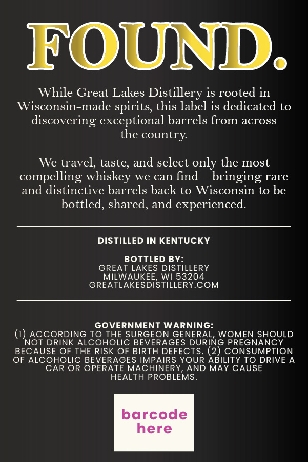
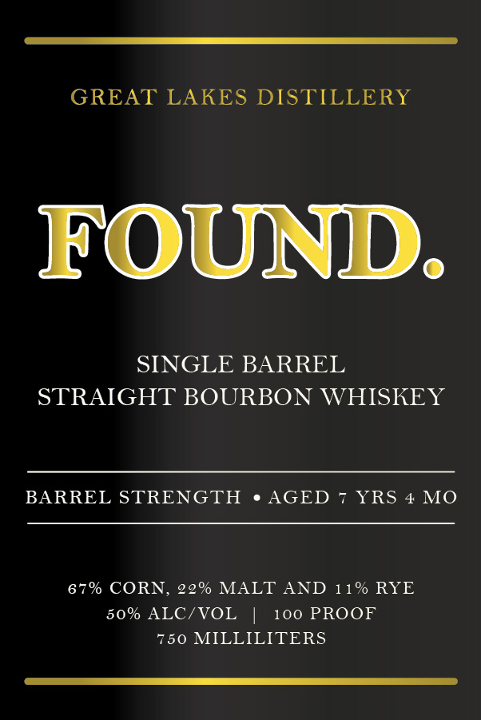

# TTB COLA Label Images - TTBID 26106001000796

**Brand Name:** FOUND.

**Issue Date:** 04/20/2026

**Origin Code:** 48

**Product Class/Type:** 101

**Source:** [TTB Public COLA Registry](https://ttbonline.gov/colasonline/viewColaDetails.do?action=publicFormDisplay&ttbid=26106001000796)

## Label Images

### Back Label

### Front Label

## Extracted Label Text

*Text extracted via OCR - may contain errors*

**Detected Proof:** 100

### Back Label

FOUND:
While Great Lales Distillery is rooted in
Wisconsin-made spirits, this label is dedicated to
discovering exceptional barrels fiom across
the country
We travel, taste, and select only the most
compelling whiskey we can find
bringing rare
and distinctive barrels back to Wisconsin to be
bottled, shared, and experienced
DISTILLED IN KENTUCKY
BOTTLED BY:
GREAT LAKES DISTILLERY
MILWAUKEE
WI 53204
GREATLAKESDISTILLERYCOM
GOVERNMENT WARNING:
ACCORDING TO THE SURGEON GENERAL; WOMEN SHOULD
NOT DRINK ALCOHOLIC BEVERAGES DURING PREGNANCY
BECAUSE OF THE RISK OF BIRTH DEFECTS
(2) CONSUMPTION
OF ALCOHOLIC BEVERAGES IMPAIRS YOUR ABILITY TO DRIVE A
CAR OR OPERATE MACHINERY
AND MAY CAUSE
HEALTH PROBLEMS_
barcode
here

### Front Label

GREAT LAKES DISTILLERY
FOUND
SINGLE BARREL
STRAIGHT BOURBON WHISKEY
BARREL STRENGTH
AGED
YRS
4 MO
67% CORN, 22% MALT AND 11 % RYE
50% ALC/VOL
100 PROOF
750 MILLILITERS
