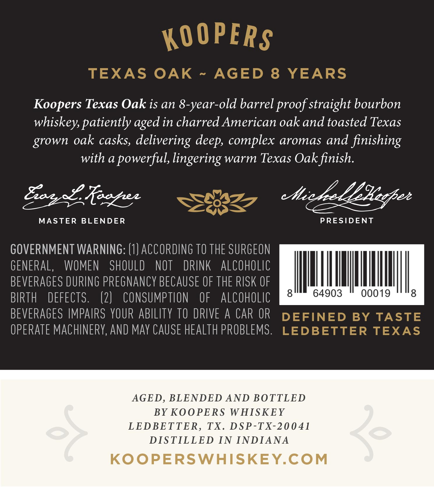
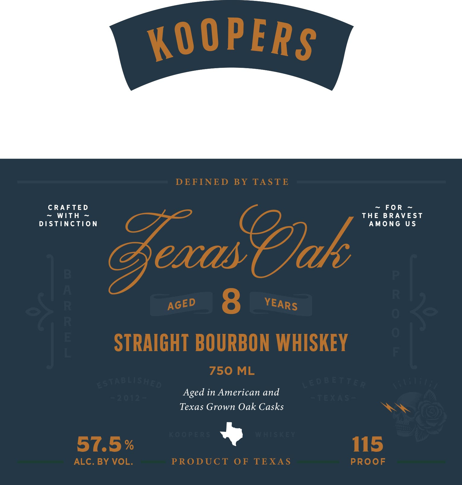

# TTB COLA Label Images - TTBID 26106001000828

**Brand Name:** KOOPERS

**Fanciful Name:** TEXAS OAK

**Issue Date:** 04/20/2026

**Origin Code:** 44

**Product Class/Type:** 101

**Source:** [TTB Public COLA Registry](https://ttbonline.gov/colasonline/viewColaDetails.do?action=publicFormDisplay&ttbid=26106001000828)

## Label Images

### Back Label

### Front Label

## Extracted Label Text

*Text extracted via OCR - may contain errors*

**Detected Proof:** 115

### Back Label

Koopers Texas Oak is an 8-year-old barrel proof straight bourbon

whiskey, patiently aged in charred American oak and toasted Texas

grown oak casks, delivering deep, complex aromas and finishing

with a powerful, lingering warm Texas Oak finish

Me

CEC

Scag Le foagee

MASTER BLENDER

PRESIDENT

GOVERNMENT WARNING: (1) ACCORDING TO THE SURGEON

GENERAL, WOMEN SHOULD NOT DRINK ALCOHOLIC

BEVERAGES DURING PREGNANCY BECAUSE OF THE RISK OF

II

|

til

I

BIRTH DEFECTS

(2) CONSUMPTION OF ALCOHOLIC

64903

00019

BEVERAGES IMPAIRS YOUR ABILITY TO DRIVE A CAR OR

OPERATE MACHINERY, AND MAY CAUSE HEALTH PROBLEMS

AGED, BLENDED AND BOTTLED

BY KOOPERS WHISKEY

LEDBETTER, TX. DSP-TX-20041

DISTILLED IN INDIANA

KOOPERSWHISKEY.COM

### Front Label

KOOPERS
DEFINED
BY TASTE
CRAFTE D
Fo R
WITh
THE BRAVE ST
DSTinCTiON
AmonG
U$
GeacasOak
P
6
8
0
0
STRAIGHT BOURBON WHISKEY
750 ML
estaBLishEd
LE D B ETTER
Aged in American and

Texas Grown Oak Casks
EEF
Ft[[F
57.5 %
115
ALC. BY VOL.
PRODUCT
OF
TEXAS
PROoF
Ks
3('
YEARS
AGED
