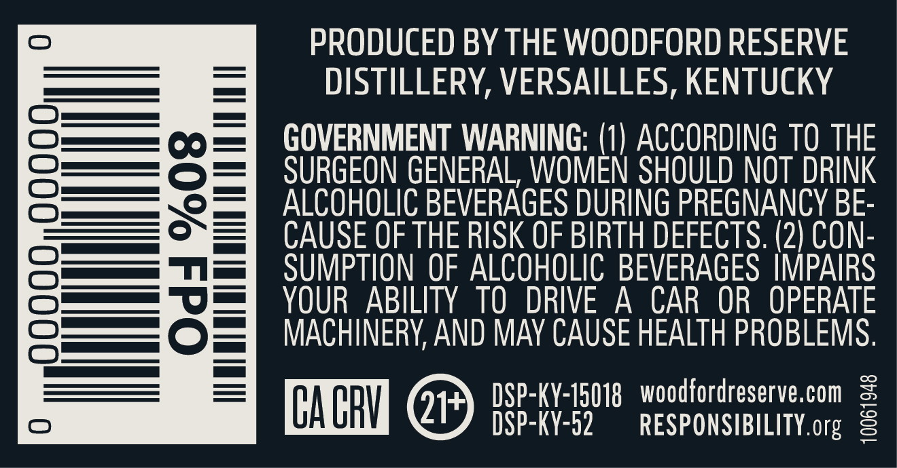
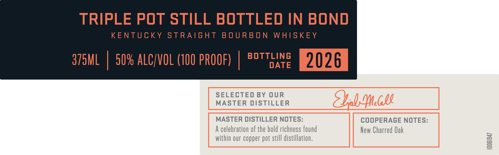

# TTB COLA Label Images - TTBID 26107001000078

**Brand Name:** WOODFORD RESERVE

**Fanciful Name:** TRIPLE POT STILL BOTTLED IN BOND

**Issue Date:** 04/20/2026

**Origin Code:** 22

**Product Class/Type:** 111

**Source:** [TTB Public COLA Registry](https://ttbonline.gov/colasonline/viewColaDetails.do?action=publicFormDisplay&ttbid=26107001000078)

## Label Images

### Back Label

### Front Label

### Label 1

### Label 4

### Label 5

## Extracted Label Text

*Text extracted via OCR - may contain errors*

*1 image(s) excluded: text did not meet readability threshold*

**Detected Proof:** 100

### Back Label

0
PRODUCED BY THE WOODFORD RESERVE
DISTILLERY, VERSAILLES, KENTUCKY
GOVERNMENT WARNING: (1) ACCORDING TO THE
2
8
SURGEON GENERAL; WOMEN SHOULD NOT DRINK
ALCOHOLIC BEVERAGES DURING PREGNANCY BE-
CAUSE OF THE RISK OF BIRTH DEFECTS: (2) CON-
SUMPTION OF ALCOHOLIC BEVERAGES  IMPAIRS
8
3
YOUR
ABILITY TO  DRIVE
A
CAR  OR  OPERATE
MACHINERV, AND MAY CAUSE HEALTH PROBLEMS.
CA CRV
21
BSP-KY-K5018
ResforSEBet?aeor
2

### Front Label

TRIPLE POT STILL BOTTLED IN BOND

KENTUCKY STRAIGHT BOURBON WHISKEY

TLING

375ML | 50% ALC/VOL (100 PROOF) | ®°7

DATE

2026.

SELECTED BY OUR

MASTER DISTILLER

MASTER DISTILLER NOTES:

COOPERAGE NOTES:

A celebration of the bold richness found

New Charred Oak

within our copper pot still distillation.

### Label 4

PEEP EEEEED EEE PTET EE EE EEE PTET EEE EERE EEE ~

LIMITED

RELEASE

PEEEEEEE ED EE EET EE EE EEE PEPE TEEPE EE EEE EEE TEEPE EEE EEE EEE EEE y

### Label 5

tint

PELEEUEEUEEEEETEEOEE

PELLUEEEUEEDEEEEEEEE

DOUUO OU

PEneneanee

benuniat

Vrtineaneds

PEDUEEUEEEEREEETEEE EE

tonite

HILVE 1TIVWS

HANOCRAFTEO

O3aljavyuagogNnvu

SMALL BATCH

PEUEEUUEEDEUEETT EEG

DEDUCE EUUEOCEE EEOC EET

PEUEEEGEEGEe eee

Preennieeds

PEDUUEUEEEEO Tea

tonne
