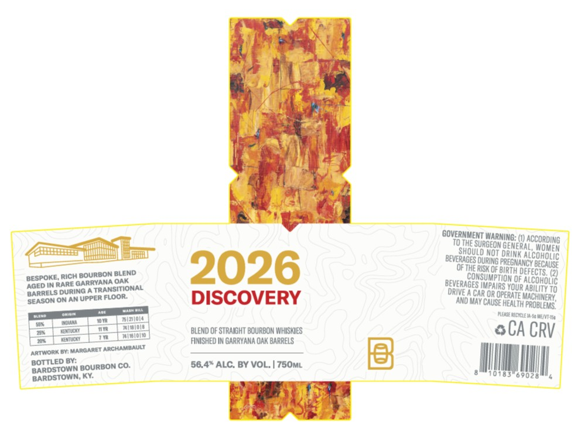
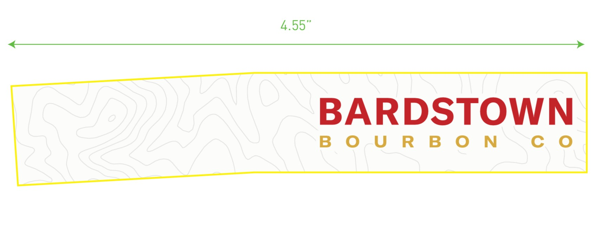
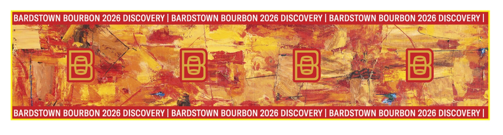

# TTB COLA Label Images - TTBID 26107001000163

**Brand Name:** BARDSTOWN BOURBON CO.

**Fanciful Name:** DISCOVERY 2026

**Issue Date:** 04/20/2026

**Origin Code:** 22

**Product Class/Type:** 121

**Source:** [TTB Public COLA Registry](https://ttbonline.gov/colasonline/viewColaDetails.do?action=publicFormDisplay&ttbid=26107001000163)

## Label Images

### Label 1

### Label 2

### Label 3

## Extracted Label Text

*Text extracted via OCR - may contain errors*

*1 image(s) excluded: text did not meet readability threshold*

### Label 1

GOVERHMENT WARMING: () accoroing
TOTHE SuRGEON GemeRALS WomER
Fshouldiot ORNNER ALConolc
beverages OURUNG^
MANCY because
BOURBoN BLEND
2026
Of TerSoe BIRin dEFEcTS (2)
BGSDOkerRice GboraQA OAk
BEVERaGES SupiptioNcOE ALCoholic
BGrRENs During
TRANSITIONAL
orive 6 CR OA OperoUR AbiYOo
sersglsoran Upper Floor
DISCOVERY
"NEJAN CAB @Pealth problews'
PROBLEMS
ae
BLEND OF STRAGHT BOURBOM MHLSKIES
CA CRV
FNISHED IN GaRRVANA Oak barrELS
Artwork By: MARQARET ArchaMbAULT
BORDSETDOBN BOURBON CO:
56.4" ALC: BY VOL: | 750ML
BARDSTOWN
BARDSTOWN; KY:
6 902 8
PREGY

### Label 3

BARDSTOWN BOURBON 2026 DISCOVERY
BARDSTOWN BOURBON 2026 DISCOVERY
BARDSTOWN BOURBON 2026 DISCOVERY
BARDSTOWN BOURBON 2026 DISCOVERY
BARDSTOWN BOURBON 2026 DISCOVERY
BARDSTOWN BOURBON 2026 DISCOVERY
