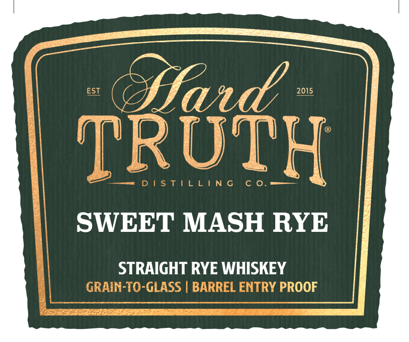
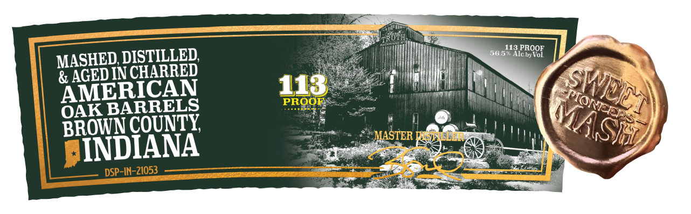
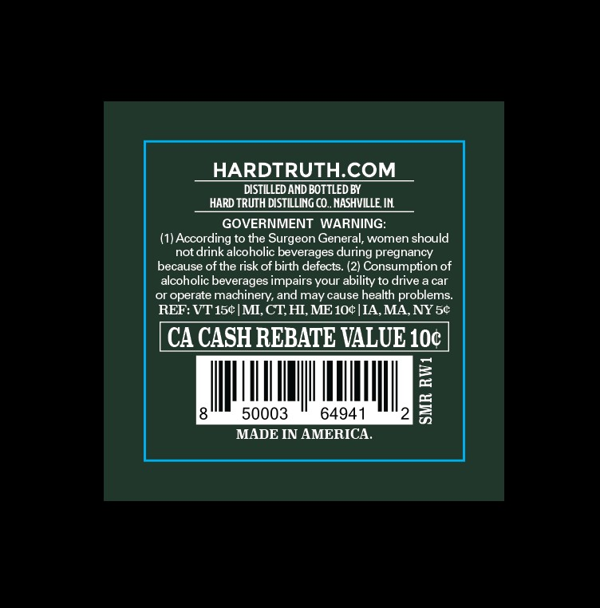

# TTB COLA Label Images - TTBID 26107001000310

**Brand Name:** HARD TRUTH DISTILLING CO.

**Issue Date:** 04/20/2026

**Origin Code:** 19

**Product Class/Type:** 102

**Source:** [TTB Public COLA Registry](https://ttbonline.gov/colasonline/viewColaDetails.do?action=publicFormDisplay&ttbid=26107001000310)

## Label Images

### Back Label

### Label 1

### Label 2

### Label 3

## Extracted Label Text

*Text extracted via OCR - may contain errors*

**Detected Proof:** 113

### Back Label

DISTILLED
WITH THE
FINEST
GRAINS CWATER
BYINDIANAS
SWEET MASH
TM
PIONEERS

### Label 1

EST
ffad
2015
TRUTH
5 T
N 6
SWEET MASH RYE
STRAIGHT RYE WHISKEY
GRAIN-TO-GLASS
BARREL ENTRY PROOF

### Label 2

DISTILLED
56,5113
PBOOE
MASHED
& AGEDIN CHARRED
AMERICAN
113
PROOF
OAK BARRELS
BROWN COUNTY
MASTER
Keeii
INDIANA
DSP-IN-21053
Alcby-
SWILA
PIONEEER
MASH

### Label 3

HARDTRUTHCOM
DISTILLED AND BOTTLED BY
HARD TRUTH DISTILLING CO_NASHVILLE IN
GOVERNMENT WARNING:
(1) According to the
eon General; women should
not drink alcoholic beverages during pregnancy
because of the risk of birth defects: (2) Consumption of
alcoholic beverages impairs your ability to drive -
car
or operate
machinery, and may cause health problems_
REF: VT 154 [MI, CT HI,ME 10t [IA,MA,NY Sc
CA CASH REBATE VALUE1OC
2
50003
64941
8
MADE IN AMERICA.
Surge
