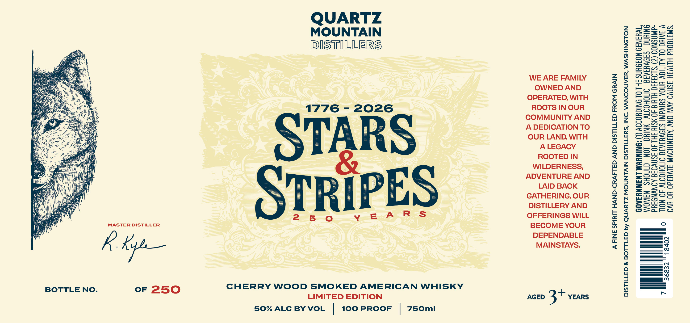
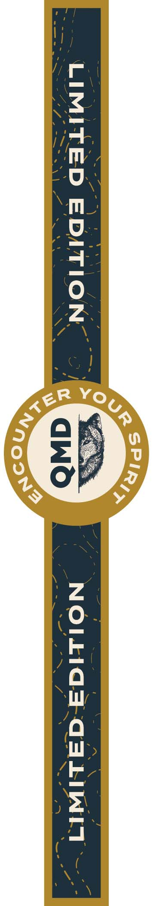

# TTB COLA Label Images - TTBID 26107001000341

**Brand Name:** QUARTZ MOUNTAIN DISTILLERS

**Fanciful Name:** STARS & STRIPES AMERICAN WHISKY

**Issue Date:** 05/01/2026

**Origin Code:** 07

**Product Class/Type:** 140

**Source:** [TTB Public COLA Registry](https://ttbonline.gov/colasonline/viewColaDetails.do?action=publicFormDisplay&ttbid=26107001000341)

## Label Images

### Label 1

### Label 2

## Extracted Label Text

*Text extracted via OCR - may contain errors*

*1 image(s) excluded: text did not meet readability threshold*

**Detected Proof:** 100

### Label 1

QUARTZ

7S

xctn

MOUNTAIN

==

Si

wu >

==Nn

cma

al

DISTILLERS

meCZaASG

=a=norao

Ssen>=

=oSe ee

aeenads

i ee

mui

hy

Mf

WE ARE FAMILY

Mita

Wwicon ~

i=

OWNED AND

usSA

TB

exsa=z>

Foleses

OPERATED, WITH

Sztecr>

ROOTS IN OUR

=on

1776 - 2026

ao m=

hi

Ze

a

COMMUNITY AND

= So

A DEDICATION TO

our ln

SI

Sol aae

Hi Z

OUR LAND. WITH

—ate

Fa

H\

A LEGACY

2o5oun=

A

==

——)

mao

AM

ST

ROOTED IN

— i

i

WILDERNESS,

SraGo

a=

&

——

aoc

\

ADVENTURE AND

o> Oui

a

i

i

LAID BACK

SG

=a"

\

che

i

GATHERING, OUR

S=

aa

i

ES

DISTILLERY AND

=

= co

y

T

aro

S

250

yY E

ARS

OFFERINGS WILL

MASTER DISTILLER

BECOME YOUR

\ Vy

DEPENDABLE

MAINSTAYS.

-——

fe kyo

ee oy)

a SO

= co

—e

CHERRY WOOD SMOKED AMERICAN WHISKY

BOTTLE NO.

or 250

LIMITED EDITION

AGED 3 + YEARS

50% ALC BY VOL

100 PROOF

750mI
