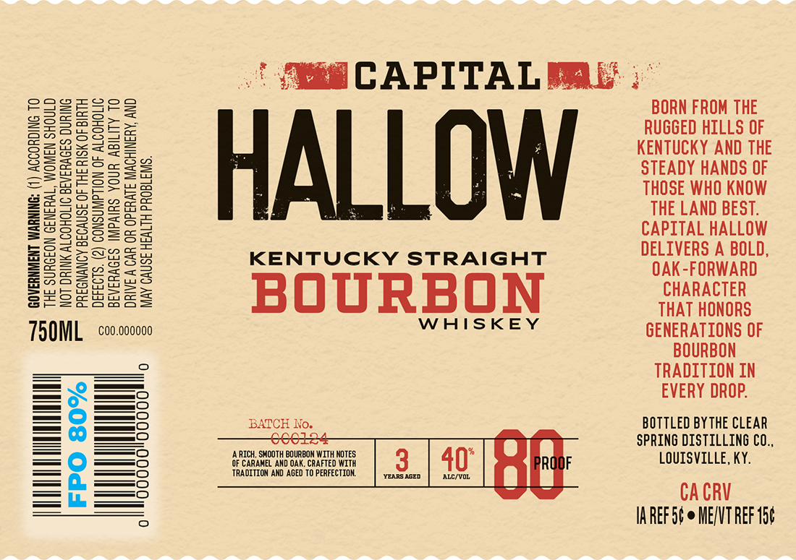
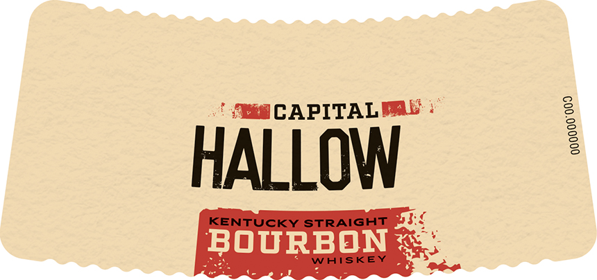

# TTB COLA Label Images - TTBID 26107001000370

**Brand Name:** CAPITAL HALLOW

**Issue Date:** 04/20/2026

**Origin Code:** 22

**Product Class/Type:** 101

**Source:** [TTB Public COLA Registry](https://ttbonline.gov/colasonline/viewColaDetails.do?action=publicFormDisplay&ttbid=26107001000370)

## Label Images

### Label 1

### Label 2

## Extracted Label Text

*Text extracted via OCR - may contain errors*

### Label 1

' CAPITAL PAL

a

3

cogzrooa

soe

PaS2ZESF2

a2f>

BORN FROM THE

aa

=>

Boo =a

Slaw

RUGGED HILLS OF

(ee

Say

eens

sa

KENTUCKY AND THE

2s

S2sas—

ea

SS

==

STEADY HANDS OF

==

SB

aS

THOSE WHO KNOW

SoS

geo

Sa

weega

ES

THE LAND BEST.

=o

=aL2

BZa=SSa=

SE

HALLOW

SSs=s6a

CAPITAL HALLOW

4

BS=o

B2lsseeun

KENTUCKY STRAIGHT

DELIVERS A BOLD,

ea

ZSacsCaeza

cus

OAK-FORWARD

Sueo

eteoetboe=

aa

muoSS

==

CHARACTER

Sse

BOURBON

THAT HONORS

T5OML  c00.000000

WHISKEY

GENERATIONS OF

BOURBON

TRADITION IN

— > —O

—O

EVERY DROP.

= 0 =——o

BOTTLED BY THE CLEAR

o=:

oe

SPRING DISTILLING CO.,

OP CARANE A DOAK CH

WITH

IAFTED

Tt

%

LOUISVILLE, KY.

RADITION AND AGED TO PERFECTION.

vexsaceo | aic/vo.

{i

IAREFS¢ © ME/VT REF 15¢

### Label 2

CAPITALML
HALLOW
KENTUCKY STRAiGHT
Bourbon
Whiskey
I
