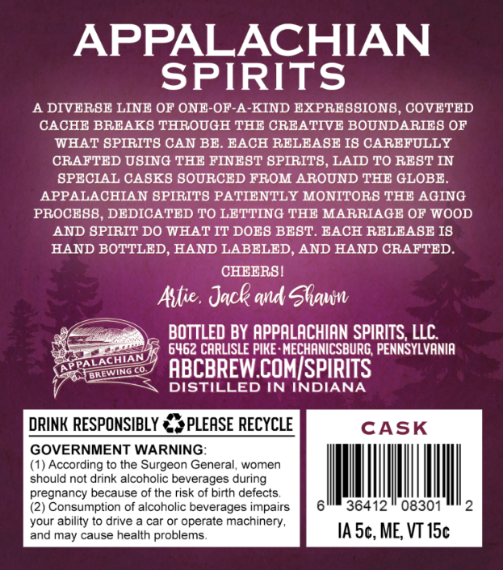
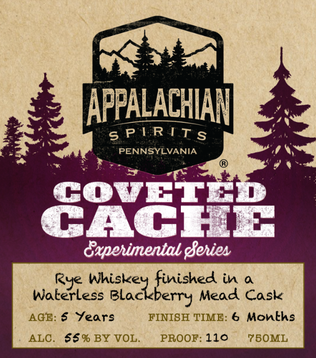

# TTB COLA Label Images - TTBID 26107001000472

**Brand Name:** APPALACHIAN SPIRITS

**Fanciful Name:** COVETED CACHE

**Issue Date:** 04/21/2026

**Origin Code:** 39

**Product Class/Type:** 142

**Source:** [TTB Public COLA Registry](https://ttbonline.gov/colasonline/viewColaDetails.do?action=publicFormDisplay&ttbid=26107001000472)

## Label Images

### Back Label

### Front Label

## Extracted Label Text

*Text extracted via OCR - may contain errors*

**Detected Proof:** 110
**Detected Age:** 6 Years

### Back Label

APPALACHIAN
SPIRITS
A DIVERSE LINE OF ONE-OF-A-KIND EXPRESBION8, COVETED
CACHE BREAK8 THROUGH THE CREATIVE BOUNDARIES OF
WHAT SPIRITS CAN BE. EACH RELEASE I8 CAREFULLY
CRAFTED USING THE FINEST 8PIRITS, LAID TO REST IN
SPECIAL CASKS SOURCED FROM AROUND THE GLOBE_
APPALACHIAN SPIRITS PATIENTLY MONITOR8 THE AGING
PROCE8S, DEDICATED TO LETTING THE MARRIAGE OF WOOD
AND GPIRIT DO WHAT IT DOES BEST. BACH RELEASE I8
HAND BOTTLED, HAND LABELED, AND HAND CRAFTED
CHEERSI
Astie , Jack and Shaun
BOTTLED BY APPALACHIAN SPIRITS, LLC
6462 CARLISLE PIKE : MECHANICSBURG, PENNSYLVANIA
ABCBREW COMISPIRITS
DISTILLED IN INDIANA
DRINK RESPONSIBLY
BPLEASE RECYCLE
CASK
GOVERNMENT WARNING:
(1) According to the Surgeon General, women
should not drink alcoholic beverages during
pregnancy because of the risk of birth defects
Consumption of alcoholic beverages impairs
36412
08301
your ability t0 drive
car Or operate machinery ,
and may cause health problems
IA 5c, ME, VT 15c
ALACHIAN
JTEWTNg

### Front Label

APPALACHIAN

ay

ie

sPIRITS

3

PENNGYEVANIA

LAN

—

g%

COoOvVvET

CACHE

aperimental Series

Rye Whiske

inished in a

Waterless Blackberry Mead Cask

AGE: 6 Years

FINISH TIME: 6 Months

ALC. 66% BY VOL.

PROOF: 110

750ML
