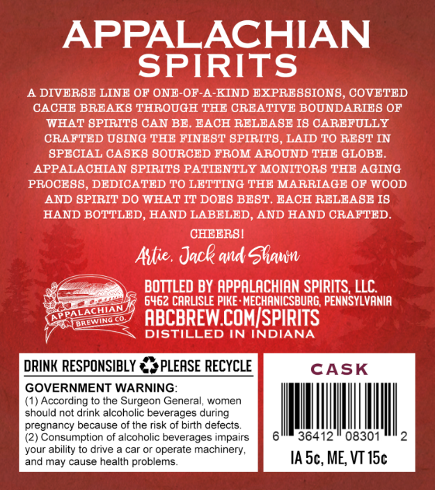
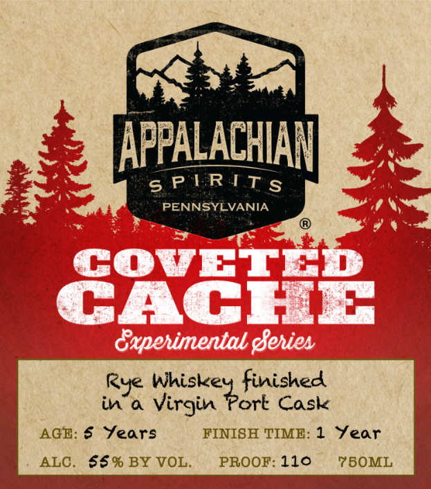

# TTB COLA Label Images - TTBID 26107001000478

**Brand Name:** APPALACHIAN SPIRITS

**Fanciful Name:** COVETED CACHE

**Issue Date:** 04/21/2026

**Origin Code:** 39

**Product Class/Type:** 142

**Source:** [TTB Public COLA Registry](https://ttbonline.gov/colasonline/viewColaDetails.do?action=publicFormDisplay&ttbid=26107001000478)

## Label Images

### Back Label

### Front Label

## Extracted Label Text

*Text extracted via OCR - may contain errors*

**Detected Proof:** 110

### Back Label

APPALACHIAN
SPIRITS
A DIVERSE LINE OF ONE-OF-A-KIND EXPRESSION8 , COVETED
CACHE BREAK8 THROUGH THE CRBATIV E BOUNDARIE8 OF
WHAT SPIRIT8 CAN BE . EACH RELEABE I8 CAREFULLY
CRAFTED USING THE FINEBT 8PIRIT8, LAID TO REBT IN
SPECIAL CASKS SOURCED FROM AROUND THE GLOBE_
APPALACHIAN SPIRITS PATIENTLY MONITORS THE AGING
PROCE8B , DEDICATED TO LETTING THE MARRIAGE OF WOOD
AND BPIRIT DO WHAT IT DOBS BEST. BACH RELEASE I8
HAND BOTTLED
HAND LABELED, AND HAND CRAFTED
CHEERBI
Astie , Jack and ShauW
BOTTLED BY APPALACHIAN SPIRITS, LLC
6462 CARLISLE PIKE : MECHANICSBURG; PENNSYLVANIA
ABCBREW COMISPIRITS
DISTILLED IN INDIANA
DRINK RESPONSIBLY
PLEASE RECYCLE
CASK
GOVERNMENT WARNING
(1) According to the Surgeon General,
women
should not drink alcoholic beverages during
pregnancy because of the risk of birth defects.
Consumption of alcoholic beverages impairs
36412
08301
your ability to drive
car or operate machinery ,
and may cause health problems
IA 5c, ME; VT I5c
PALACHIN
[RLWINGL

### Front Label

wi

a

AP

P

foros ete

A

LACHIAN

sPIRITS

PENG UEVANIA

Rye Whiskey finished

in’a virgin Port Cask

AGE: § Years

FINISH TIME: 1 Year

ALC. $§% BY VOL.

PROOF: 110

750ML
