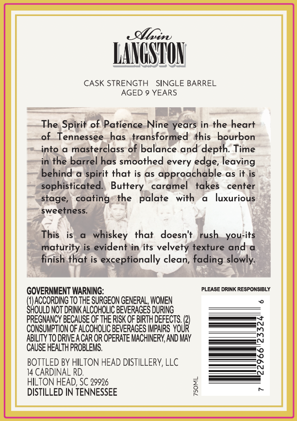
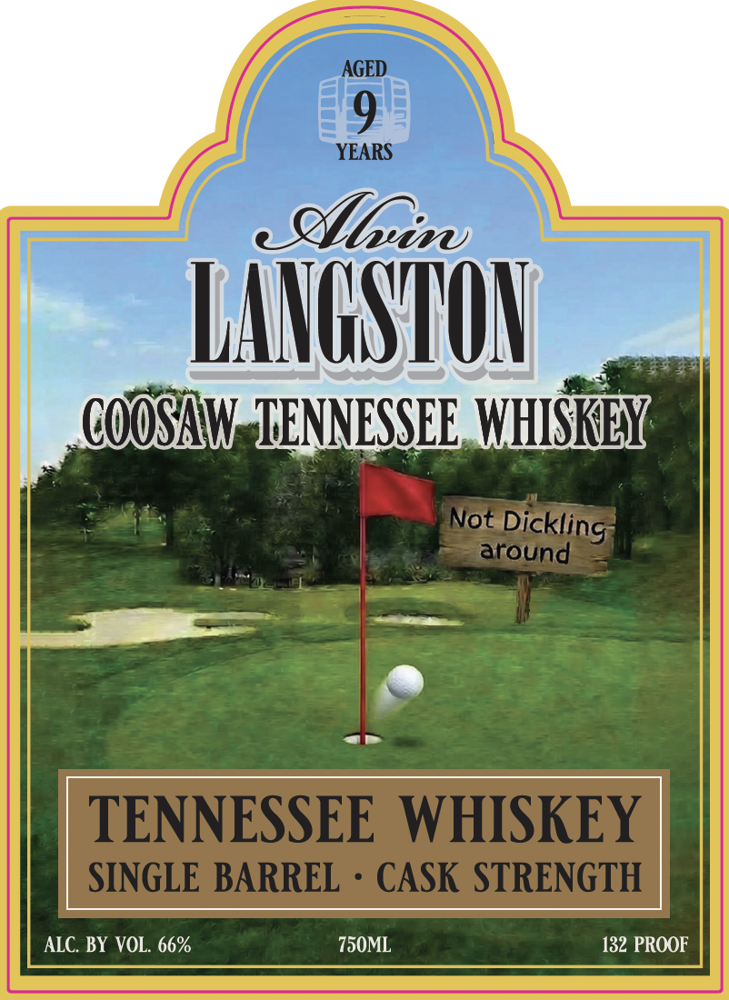

# TTB COLA Label Images - TTBID 26107001000489

**Brand Name:** ALVIN LANGSTON

**Fanciful Name:** COOSAW TENNESSEE WHISKEY

**Issue Date:** 04/21/2026

**Origin Code:** 41

**Product Class/Type:** 140

**Source:** [TTB Public COLA Registry](https://ttbonline.gov/colasonline/viewColaDetails.do?action=publicFormDisplay&ttbid=26107001000489)

## Label Images

### Back Label

### Front Label

## Extracted Label Text

*Text extracted via OCR - may contain errors*

**Detected Proof:** 132
**Detected Age:** 9 Years

### Back Label

luz
LANGSTON
CASK STRENGTH
SINGLE BARREL
AGED
YEARS
The Spirit of Patience Nine years in the heart
of Tennessee
has transformed this bourbon
into
masterclass of balance and depth: Time
in the barrel has smoothed every edge, leaving
behind
spirit that is as
approachable as it is
sophisticated  Buttery
caramel
takes
center
stage,
coating
the
palate
with
luxurious
sweetness
This
whiskey
that
doesn't
you-its
maturity is evident in its velvety texture and a
finish that is exceptionally clean, fading slowly:
GOVERNMENT WARNING:
PLEASE DRINK RESPONSIBLY
ACCORDING To THE SURGEON GENERAL, WOMEN
SHOULD NOT DRINK ALCOHOLIC BEVERAGES DURING
PREGNANCY BECAUSE OF THE RISK OF BIRTHDEFECTS,
You?
CONSUMPTION OF ALCOHOLIC BEVERAGES IMPAIRS
ABILITY TO DRIVEA CAR OR OPERATE MACHINERY,AND MAY
CAUSE HEALTH PROBLEMS,
BOTTLED BY HILTON HEAD DISTILLERY, LLC
14 CARDINAL RD:
HILTON HEAD; SC 29926
DISTILLED IN TENNESSEE
2
rush

### Front Label

AGED
9
YEARS
elGsi
LAVGSTON
COOSAw 'TENNESSEE WHISKLY
Not
around
TENNESSEE WHISKEY
SINGLE BARREL
CASK STRENGTH
ALC BY VOL. 66%
750ML
132 PROOF
Dickling
