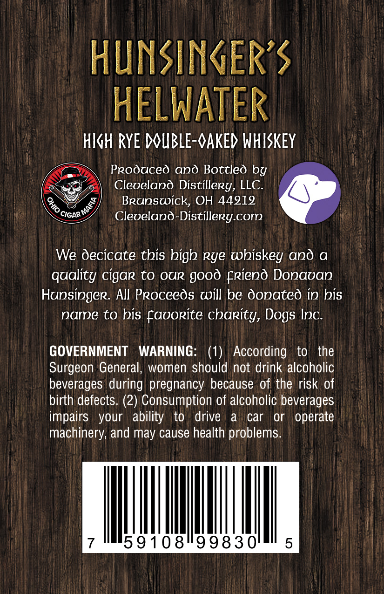
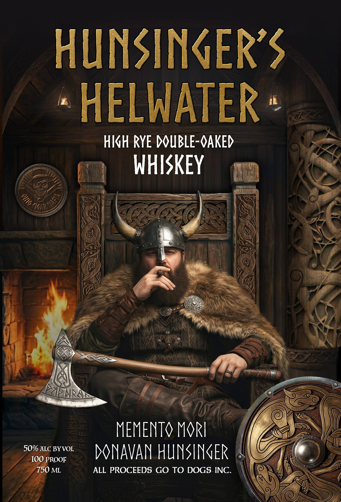

# TTB COLA Label Images - TTBID 26107001000504

**Brand Name:** HUNSINGER'S

**Fanciful Name:** HELWATER

**Issue Date:** 04/27/2026

**Origin Code:** 09

**Product Class/Type:** 140

**Source:** [TTB Public COLA Registry](https://ttbonline.gov/colasonline/viewColaDetails.do?action=publicFormDisplay&ttbid=26107001000504)

## Label Images

### Back Label

### Front Label

## Extracted Label Text

*Text extracted via OCR - may contain errors*

**Detected Proof:** 100

### Back Label

HUNSINGER’S

HELWATER

HIGH RYE DOUBLE-OAKED WHISKEY

Produced ano Bottled by

y

Cleveland Distillery, LLC

§,

Brunswick, OH 44919

cignn

Clevelano-Distillegy.com

We Oecicate this high rye whiskey and a

quality cigar to our good friend Donavan

Hunsinger. All Proceeds will be Oonated in his

name to his favorite charity, Dogs Inc

GOVERNMENT WARNING

(1) According to the

Surgeon General, women should not drink alcoholic

beverages during pregnancy because of the risk of

birth defects. (2) Consumption of alcoholic beverages

impairs your ability to drive a car or operate

machinery, and may cause health problems

Ih

59108°99830

### Front Label

HUNSINGERS
HELWATER
HKH RYE DUBLE-OAKED
WHISKEY
KKir
MEMENTO MkI
50% HIC BYVOL
MNAVAN HUNSINER
100 PROOF
750 ML
ALL PROCEEDS GO TO DOGS INC:
0
