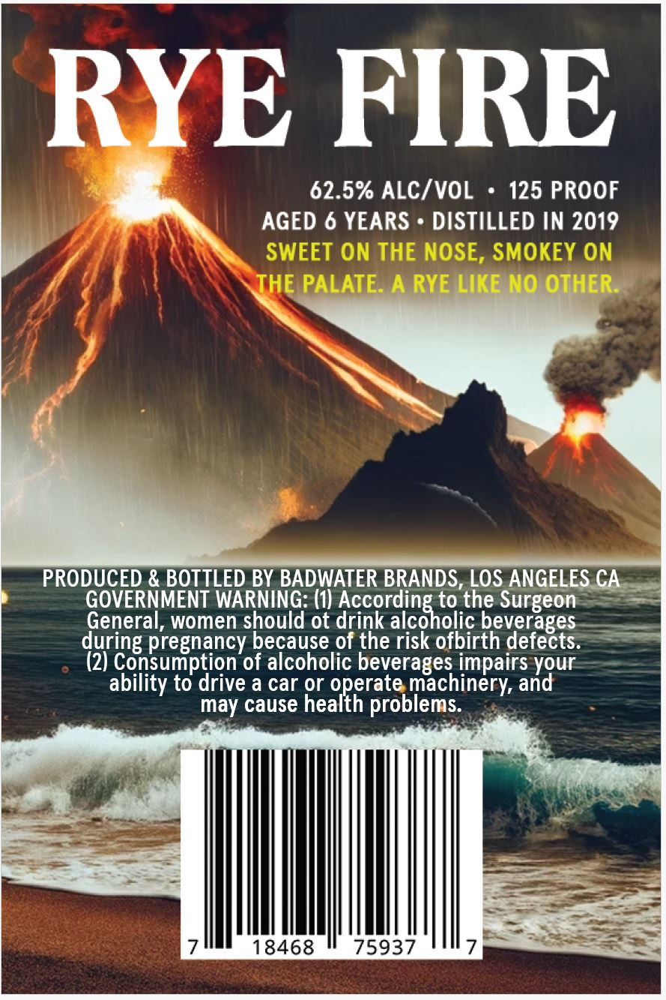
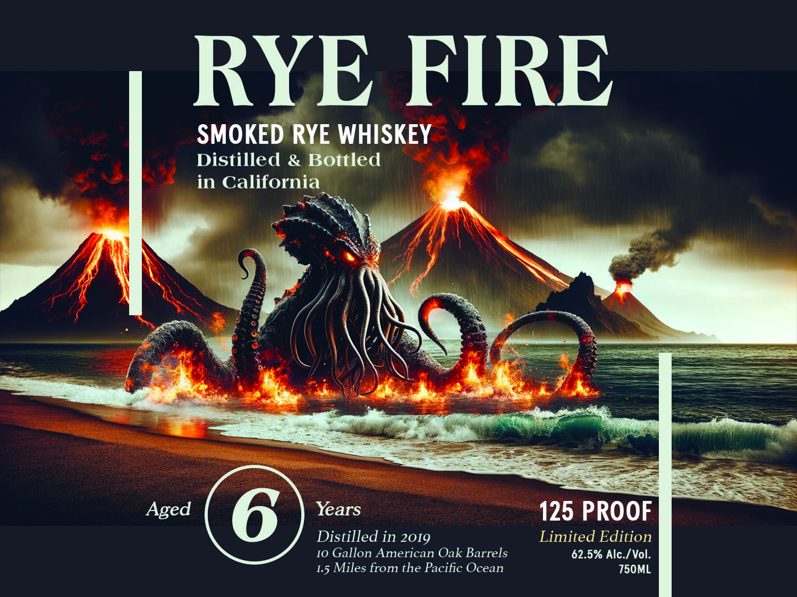

# TTB COLA Label Images - TTBID 26107001000507

**Brand Name:** RYE FIRE

**Fanciful Name:** SMOKED RYE WHISKEY

**Issue Date:** 04/21/2026

**Origin Code:** 01

**Product Class/Type:** 142

**Source:** [TTB Public COLA Registry](https://ttbonline.gov/colasonline/viewColaDetails.do?action=publicFormDisplay&ttbid=26107001000507)

## Label Images

### Back Label

### Label 1

## Extracted Label Text

*Text extracted via OCR - may contain errors*

**Detected Proof:** 125
**Detected Age:** 6 Years

### Back Label

RYE FIRE
62.5% ALC/VOL
125 PROOF
AGED 6 YEARS
DISTILLED IN 2019
SWEET ON THE NOSE, SMOKEY ON
THE PALATE. A RYE LIKE NO OTHER_
PRODUCED & BOTTLED BY BADWATER BRANDS, LOS ANGELES CA
GOVERNMENT WARNING; (1) According to the Surgeon
General, women should ot drink alcoholic beverages
during pregnancy because of the risk ofbirth defects.
(2) Consumption of alcoholic beverages impairs
ability to drive a car or operate machinery, and
may cause health problems:
18468
75937
7
your

### Label 1

RYE FIRE
SMOKED RYE WHISKEY
Distilled & Bottled
in California
Aged
6
Years
125 PROOF
Distilled in 2019
Limited Edition
I0 Gallon American Oak Barrels
62.5% Alc./ Vol
15 Miles from the Pacific Ocean
Z50ML
