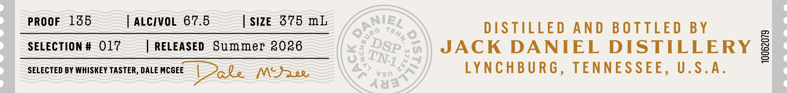

# TTB COLA Label Images - TTBID 26107001000531

**Brand Name:** JACK DANIEL'S

**Fanciful Name:** DISTILLERY SERIES

**Issue Date:** 04/23/2026

**Origin Code:** 43

**Product Class/Type:** 140

**Source:** [TTB Public COLA Registry](https://ttbonline.gov/colasonline/viewColaDetails.do?action=publicFormDisplay&ttbid=26107001000531)

## Label Images

### Front Label

### Label 3

## Extracted Label Text

*Text extracted via OCR - may contain errors*

*1 image(s) excluded: text did not meet readability threshold*

**Detected Proof:** 135

### Front Label

PROOF
135
ALCIVOL 67.5
SIZE
375 mL
DSTILLED
A N D
B 0TTLED BY
SELECTION # 017
RELEASED
Summer 2026
JACK
DANIEL
DISTILLERY
0
SELECTED BY WHISKEY TASTER, DALE MCGEE
Zale
M-)Ree
Vso
LYNCHBURG , TENNESSEE, U.S.A.
443
Qanieg
TenN;
URG
0
(
DSP
4
0
TN-L
