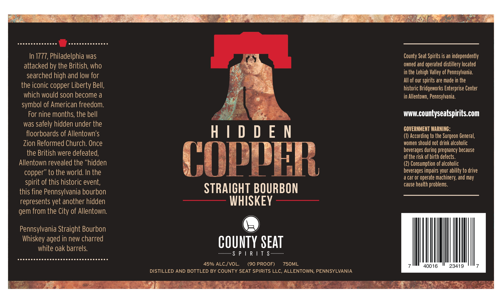
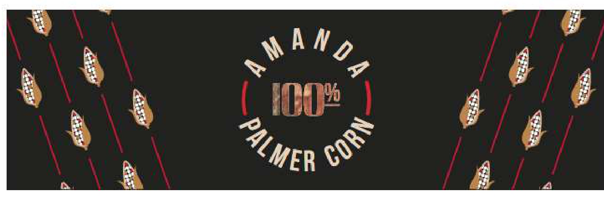

# TTB COLA Label Images - TTBID 26107001000743

**Brand Name:** COUNTY SEAT SPIRITS

**Fanciful Name:** HIDDEN COPPER

**Issue Date:** 04/23/2026

**Origin Code:** 39

**Product Class/Type:** 101

**Source:** [TTB Public COLA Registry](https://ttbonline.gov/colasonline/viewColaDetails.do?action=publicFormDisplay&ttbid=26107001000743)

## Label Images

### Label 1

### Label 2

## Extracted Label Text

*Text extracted via OCR - may contain errors*

*1 image(s) excluded: text did not meet readability threshold*

**Detected Proof:** 90

### Label 1

eeccccccccccccs

ecccccccccccccs

In 1777, Philadelphia was

County Seat Spirits is an independently

attacked by the British, who

owned and operated distillery located

Teed

in the Lehigh Valley of Pennsylvania

searched high and low for

All of our spirits are made in the

the iconic copper Liberty Bell

Es

historic Bridgeworks Enterprise Center

which would soon become a

in Allentown, Pennsylvania

symbol of American freedom

For nine months, the bell

ihe

www.countyseatspirits.com

was safely hidden under the

GOVERNMENT WARNING:

floorboards of Allentown's

HIDDEN

(1) According to the Surgeon General,

women should not drink alcoholic

Zion Reformed Church. Once

the British were defeated

gRep

m

ha

beverages during pregnancy because

ae ee

a

of the risk of birth defects

Allentown revealed the “hidden

(2) Consumption of alcoholic

q

y)

beverages impairs your ability to drive

copper” to the world. In the

a car or operate machinery, and may

spirit of this historic event

cause health problems

STRAIGHT BOURBON

this fine Pennsylvania bourbon

represents yet another hidden

WHISKEY

gem from the City of Allentown

Pennsylvania Straight Bourbon

Whiskey aged in new charred

white oak barrels.

COUNTY SEAT

SPIRITS

eerccccccccccccccccccccccccccccccs

750ML

|

45% ALC./VOL

(90 PROOF)

il

23419

DISTILLED AND BOTTLED BY COUNTY SEAT SPIRITS LLC, ALLENTOWN, PENNSYLVANIA

ell ss

baa
