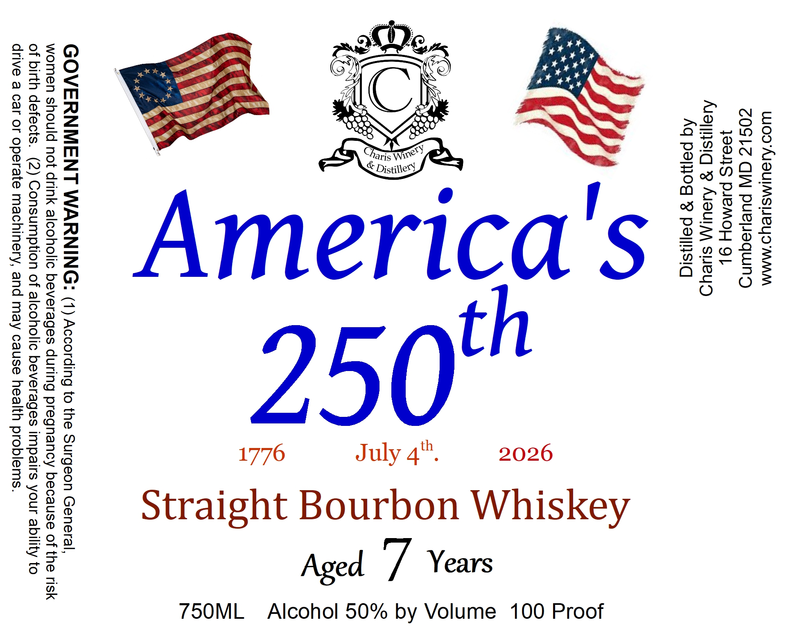

# TTB COLA Label Images - TTBID 26108001000016

**Brand Name:** CHARIS WINERY & DISTILLERY

**Fanciful Name:** AMERICA'S 250TH.

**Issue Date:** 04/21/2026

**Origin Code:** 25

**Product Class/Type:** 101

**Source:** [TTB Public COLA Registry](https://ttbonline.gov/colasonline/viewColaDetails.do?action=publicFormDisplay&ttbid=26108001000016)

## Label Images

### Label 1

## Extracted Label Text

*Text extracted via OCR - may contain errors*

**Detected Proof:** 100

### Label 1

Wwoo'AISUIMSHeUo MAM
ZOSLZ CW puejequing
1891S PJEMOH QO}
Asansiq 9 Aveul\\ sueyd
Aq pajog 8 paliisiq

>
©
ane
<
o
S ¢
CS
cy
ano)
> A Tw
ae
“33
love)
m=
of}
.
~ OD
fav)
—
ao)
—Y

GOVERNMENT WARNING: (1) According to the Surgeon General,
women should not drink alcoholic beverages during pregnancy because of the risk
of birth defects. (2) Consumption of alcoholic beverages impairs your ability to
drive a car or operate machinery, and may cause health problems.

by Volume 100 Proof

7S5O0ML_ Alcohol 50%
