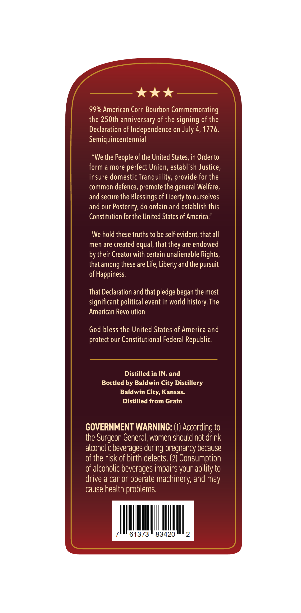
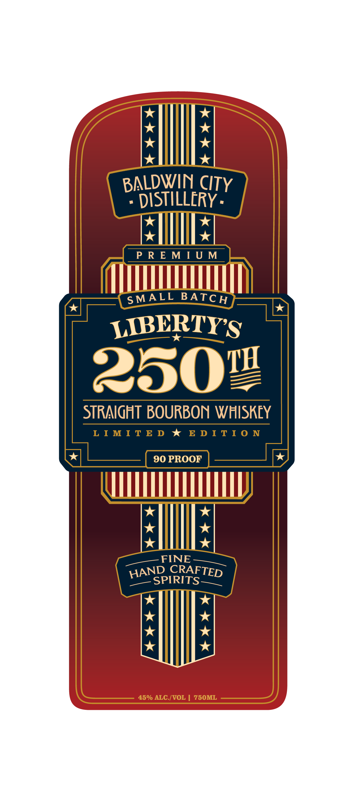

# TTB COLA Label Images - TTBID 26110001000053

**Brand Name:** BALDWIN CITY DISTILLERY

**Issue Date:** 04/23/2026

**Origin Code:** 21

**Product Class/Type:** 101

**Source:** [TTB Public COLA Registry](https://ttbonline.gov/colasonline/viewColaDetails.do?action=publicFormDisplay&ttbid=26110001000053)

## Label Images

### Back Label

### Front Label

## Extracted Label Text

*Text extracted via OCR - may contain errors*

### Back Label

kak

99% American Corn Bourbon Commemorating

the 250th anniversary of the signing of the

Declaration of Independence on July 4, 1776

Semiquincentennial

"We the People of the United States, in Order to

form a more perfect Union, establish Justice

insure domestic Tranquility, provide for the

common defence, promote the general Welfare

and secure the Blessings of Liberty to ourselves

and our Posterity, do ordain and establish this

Constitution for the United States of America

We hold these truths to be self-evident, that all

men are created equal, that they are endowed

by their Creator with certain unalienable Rights,

that among these are Life, Liberty and the pursuit

of Happiness

That Declaration and that pledge began the most

significant political event in world history. The

American Revolution

God bless the United States of America and

protect our Constitutional Federal Republic

Distilled in IN. and

Bottled by Baldwin City Distillery

Baldwin City, Kansas.

Distilled from Grain

GOVERNMENT WARNING: (1) According to

the Surgeon General, women should not drink

alcoholic beverages during pregnancy because

of the risk of birth defects. (2) Consumption

f alcoholic beverages impairs your ability to

drive a car or operate machinery, and may

cause health problems

|

|

|

|

|

ll

61373 " 83420

### Front Label

*

*

*

*

*

*

*

x

BALDWIN CITY

- DISTILLERY -

Pell:

_PREMIUM~

TTT

SMALL BATCH

{JBERTY's

2902

STRAIGHT BOURBON WHISKEY

LIMITED * EDITION

TY

HI

IE

AND CRAFTED

SPIRITS

*
