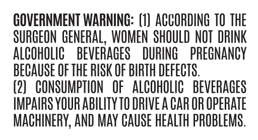
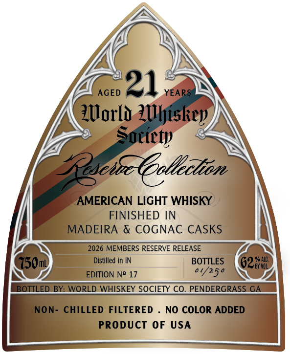

# TTB COLA Label Images - TTBID 26110001000132

**Brand Name:** WORLD WHISKEY SOCIETY

**Issue Date:** 04/21/2026

**Origin Code:** 08

**Product Class/Type:** 144

**Source:** [TTB Public COLA Registry](https://ttbonline.gov/colasonline/viewColaDetails.do?action=publicFormDisplay&ttbid=26110001000132)

## Label Images

### Back Label

### Front Label

## Extracted Label Text

*Text extracted via OCR - may contain errors*

**Detected Proof:** 124
**Detected Age:** 21 Years

### Back Label

GOVERNMENT WARNING: (1) ACCORDING 10 THE

ALCOHOLIC BEVERAGES DURING PREGNANCY

SURGEON GENERAL, WOMEN SHOULD NOT DRINK

BECAUSE OF THE RISK OF BIRTH DEFECTS.

(2) CONSUMPTION OF ALCOHOLIC BEVERAGES

IMPAIRS YOUR ABILITY 10 DRIVE A CAR OR OPERATE

MACHINERY, AND MAY CAUSE HEALTH PROBLEMS.

### Front Label

AGED
21
YEARS
ZUorLo ZUUljislicp)
Socicty
2se52 (ooltection
AMERICAN LIGHT WHISKY
FINISHED IN
MADEIRA & COGNAC CASKS
2026 MEMBERS RESERVE RELEASE
750ml)
Distilled in IN
BOTTLES
62
% ALC.
BY VOL
EDITION N? 17
0'/250
BOTTLED
BY: WORLD WHISKEY SOCIETY CO. PENDERGRASS GA
NON- CHILLED
FILTERED
NO COLOR ADDED
PRODUCT 0F
USA
