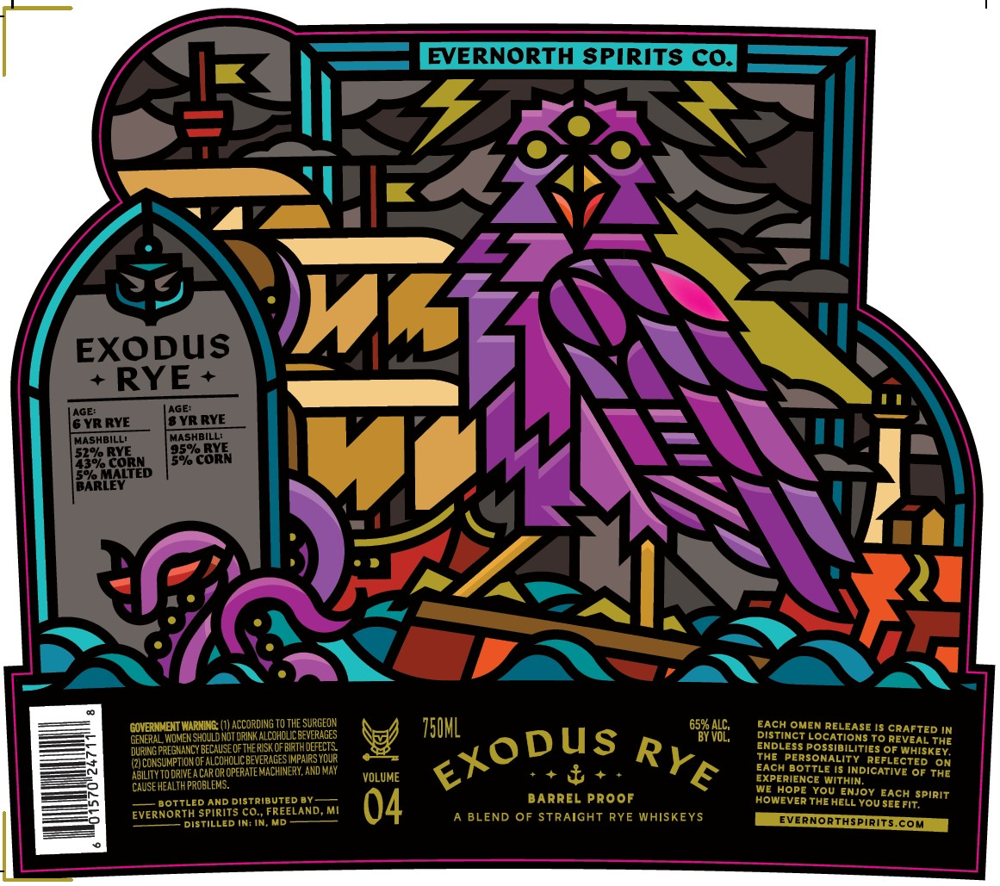

# TTB COLA Label Images - TTBID 26110001000149

**Brand Name:** EVERNORTH SPIRITS CO.

**Issue Date:** 04/21/2026

**Origin Code:** 06

**Product Class/Type:** 122

**Source:** [TTB Public COLA Registry](https://ttbonline.gov/colasonline/viewColaDetails.do?action=publicFormDisplay&ttbid=26110001000149)

## Label Images

### Label 1

## Extracted Label Text

*Text extracted via OCR - may contain errors*

**Detected Age:** 6 Years

### Label 1

EVERNORTH SPIRITS CQ
EXQRuS
wL
AGE:
6 YR RYE
8 YR RYE
MASHBILL'
MAshBILL:
P582
28x5
Ef
5ek
GOMERNMENT WARNINE
ACCoRDING TO The SUEGEON
750hL
6587 V;
EACH OMEN RELEASE IS CRAFTED IN
GENERal WOMEN Should NoT DRINK ALCCHCLICREVERAGES
DiSTiNct LocATiONS To REVEAL The
DURING PREGNANCY BECAUSE Ofthe RISK CFBIRTHDEFECTS
ENDLESS Possibilities Of Whiskey,
{2)COKSUMPTION OF ALCOHCLICBEVERAGEStMpaiRS YouR
The PERSONALITY REFLECTED
ON
TO DRIVEA Cap CR OPERATEMAChInERY, ANd May
VOLUME
1
EACH BottLe {5 INDICATIVE Of The
CAUSE HEALTH PROBLEMS:
MXPHOPNCYC
WiIthiN
HOPE You Enjoy EACH spirit
BOTTLED AND DistribUted By
BARREL Proof
HOWEVER THE HELL You SEE FIT;
EverNORTH Spirits COnFREELAND
04
A BLEND OF STRAIGHT RYE WHISKEYS
EVERNORTHSPLRLTS.
DISTILLED IN; IN
com
AGE:
Exodus
RYE
AeIUTY
