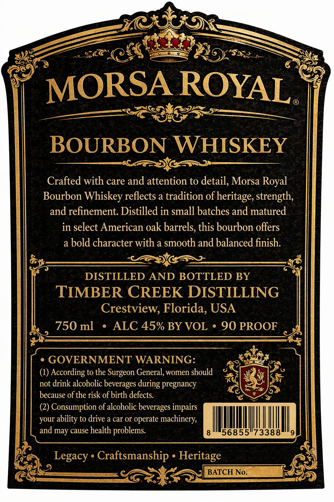
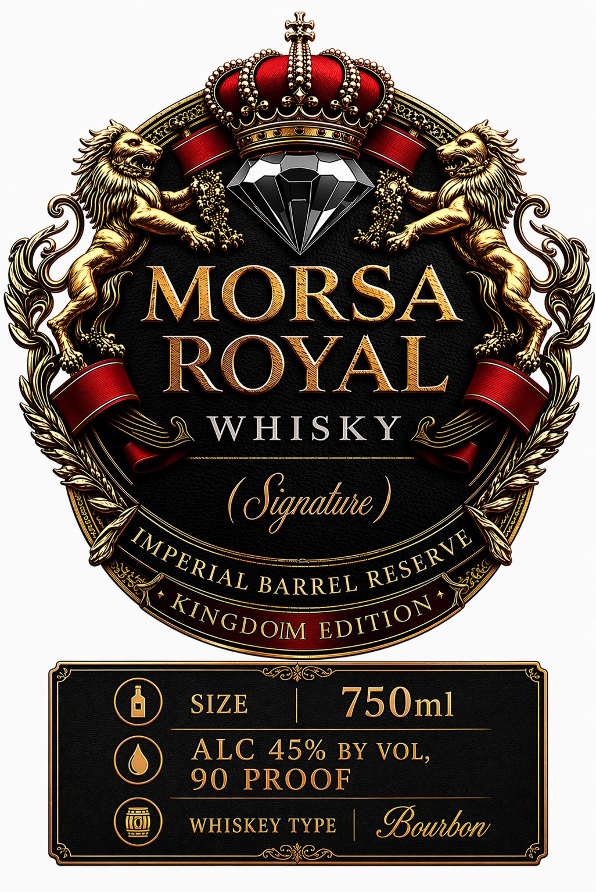

# TTB COLA Label Images - TTBID 26110001000159

**Brand Name:** MORSA ROYAL

**Issue Date:** 04/21/2026

**Origin Code:** 16

**Product Class/Type:** 141

**Source:** [TTB Public COLA Registry](https://ttbonline.gov/colasonline/viewColaDetails.do?action=publicFormDisplay&ttbid=26110001000159)

## Label Images

### Back Label

### Front Label

## Extracted Label Text

*Text extracted via OCR - may contain errors*

**Detected Proof:** 90

### Back Label

MORSA ROYAL
BOURBON WHISKEY
Crafted with care and attention to detail, Morsa Royal
Bourbon Whiskey reflects a tradition of heritage, strength;
and refinement Distilled in small batches and matured
in select American oak barrels, this bourbon offers
a bold character with a smooth and balanced finish:
DISTILLED AND BOTTLED BY
TIMBER CREEK DISTILLING
Crestview, Florida, USA
750 ml
ALC 45% BY VOL
90 PROOF
GOVERNMENT WARNING:
(1) According to the Surgeon General, women should
not drink alcoholic beverages
pregnancy
because of the risk of birth defects.
(2) Consumption of alcoholic beverages impairs
your ability to drive a car or operate machinery;
and may cause health
problems:
56855"73388
Legacy . Craftsmanship . Heritage
BATCH No.
during

### Front Label

MORSA
ROYAL
W HIS KY
@
(Oignaiue ,
BARREL
SIZE
750ml
ALC 45% BY VOL,
90 PROOF
WHISKEY TYPE
Bouhbor
IMPERIAL
RESERVE
KINGD OIM
EDITION
