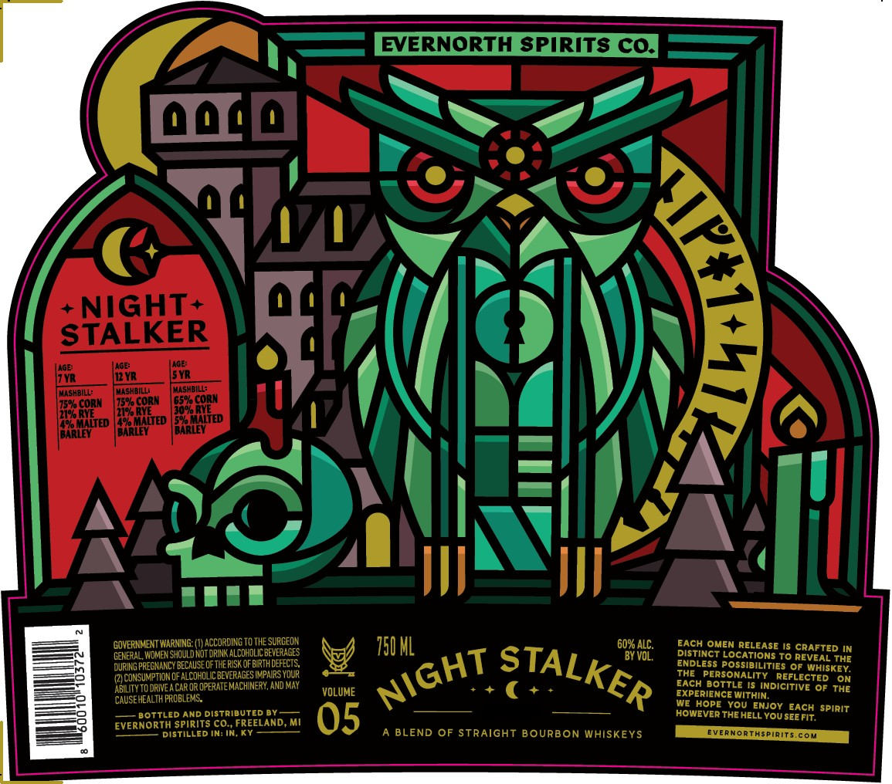

# TTB COLA Label Images - TTBID 26110001000162

**Brand Name:** EVERNORTH SPIRITS CO.

**Issue Date:** 04/21/2026

**Origin Code:** 06

**Product Class/Type:** 121

**Source:** [TTB Public COLA Registry](https://ttbonline.gov/colasonline/viewColaDetails.do?action=publicFormDisplay&ttbid=26110001000162)

## Label Images

### Label 1

## Extracted Label Text

*Text extracted via OCR - may contain errors*

**Detected Proof:** 120
**Detected Age:** 7 Years

### Label 1

EVERNORTH SPIRITS cQ]
+NIGHT+
STALKER
Adet
AGE:
AGe:
7YR
12 VR
SVR
MASHBILL:
MashbIlL;
MASHbILL;
CORN
CORN
FEE
GOVERNMENT WARNING: (V)ACCORDING TO THE SURCeOX
750 ML
60% ALC.
BACH OMEN RELEASE Is CRAFTED IN
CENeRAL, WoMeN shCuld Not
ALCOHDLIC BEVERAGES
BY VOL,
DiSTinct BocATIONS To REVEAL ThE
DURING PREGNANCY BECAUSEOFthe R SK OFBIRTHDEFECTS
ENDLESS
Ossibilities OF WHISKEY.
(2} ConSumptIon OF ALCOHOUCBEVERAGES WPNRS Youp
ThE PERSONALITY   REFLECTED
ON
ABLLITYTO DRIVEA CAr OR OPERATE MaChINeRY, ANd May
VOLUME
EXCH Bottle IS Indicitive Of ThE
CAUSE HEALTH FROELeMS
EXPERIENCE WITHIN;
WE HOPE
You_ENjoy EACH spirit
BoTTLED AnD Distributed By_
05
HOWEVER THE HELL You SEE FIT,
EVERNORTH SPIRITS CO_ FREELAND
DISTILLED IN: IN
BLEND OF STRAIGHT BOURBON WHISKEYS
EVernorthspirits com
1
STALKER
Da
NIGHT
