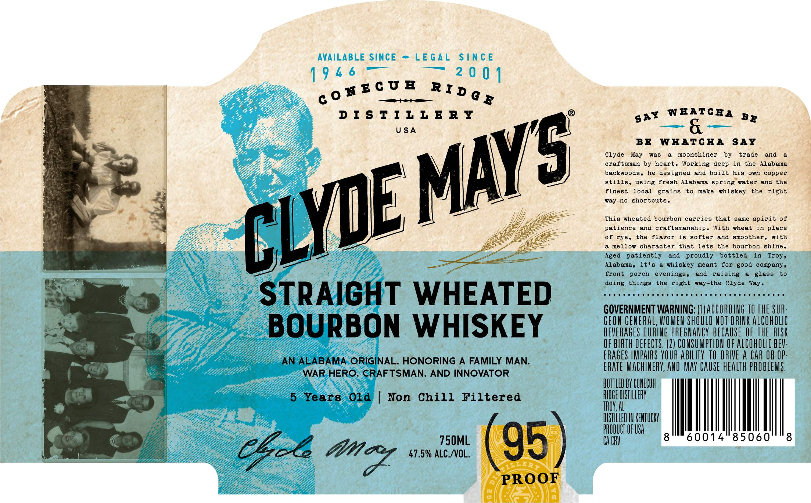
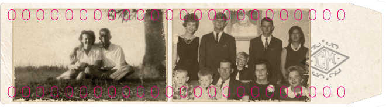
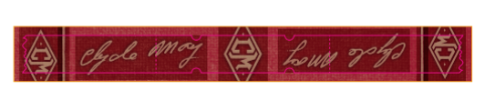

# TTB COLA Label Images - TTBID 26110001000251

**Brand Name:** CLYDE MAY'S

**Issue Date:** 04/22/2026

**Origin Code:** 10

**Product Class/Type:** 141

**Source:** [TTB Public COLA Registry](https://ttbonline.gov/colasonline/viewColaDetails.do?action=publicFormDisplay&ttbid=26110001000251)

## Label Images

### Label 1

### Label 2

### Label 3

## Extracted Label Text

*Text extracted via OCR - may contain errors*

*2 image(s) excluded: text did not meet readability threshold*

**Detected Proof:** 95
**Detected Age:** 5 Years

### Label 1

RECUEH RIDg

DISTILLERY

gat WHATCHA 5,

USA

BE WHATCHA SAY

Clyde May was a moonshiner by trade and a

craftsman by heart. Yorking deep in the Alabama

backwoods, he designed and built his own copper

stills, using fresh Alabama spring water and the

finest local grains to make whiskey the right

way-no shortcuts

=

This wheated bourbon carries that same spirit of

Of

patience and craftsmanship. With wheat in place

of rye, the flavor is softer and smoother, with

I

(he

a mellow character that lets the bourbon shine

Aged patiently and proudly bottled in Troy

Alabama, it's a whiskey meant for good company

ie

doing things the right way-the Clyde Way

front porch evenings,

and raising a glass to

xe

Bese ccc nee eee ser et ase seceuseececsteces

- STRAIGHT WHEATED

GOVERNMENT WARNING: (1) ACCORDING 10 THE SUR

e)

GEON GENERAL, WOMEN SHOULD NOT DRINK ALCOHOLIC

BOURBON WHISKEY

BEVERAGES DURING PREGNANCY BECAUSE OF THE RISK

oy

BIATH DEFECTS. (2) CONSUMPTION OF ALCOHOLIC BEV

~~

AN ALABAMA. ORIGINAL, HONORING A FAMILY MAN.

ERAGES IMPAIRS YOUR ABILITY 10 Mie A CAR Of OP-

WAR. HERO; GRAF TSMAN, AND INNOVATOR

a ACHINERY, AND MAY CAUSE H

EALTH PROBLEMS.

cp |

V CONECUH

hes

LLERY

5 Years Old | Non Chill Filtered

in ae

Ox

750ML

TL

fev

47.5% ALC/VOL.

cat:

Chol we
