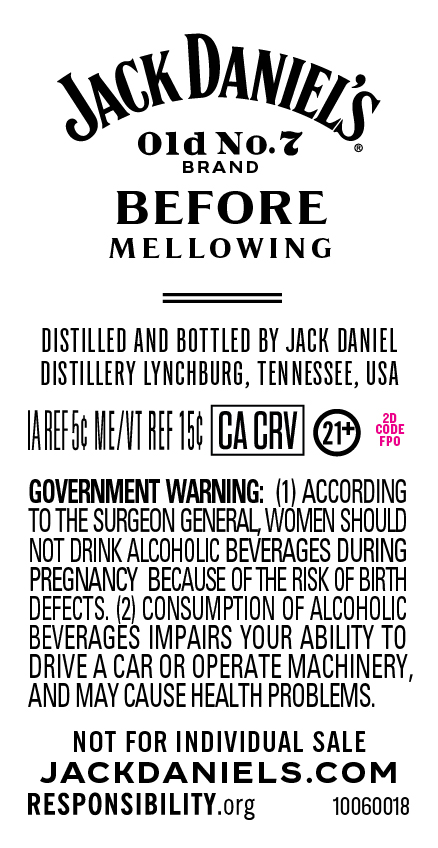
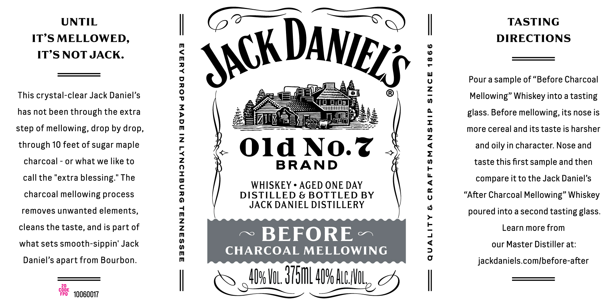

# TTB COLA Label Images - TTBID 26110001000377

**Brand Name:** JACK DANIEL'S

**Fanciful Name:** BEFORE

**Issue Date:** 04/22/2026

**Origin Code:** 43

**Product Class/Type:** 140

**Source:** [TTB Public COLA Registry](https://ttbonline.gov/colasonline/viewColaDetails.do?action=publicFormDisplay&ttbid=26110001000377)

## Label Images

### Back Label

### Front Label

### Label 3

## Extracted Label Text

*Text extracted via OCR - may contain errors*

*1 image(s) excluded: text did not meet readability threshold*

### Back Label

Old No.z
BRAND
BEFORE
MELLOWING
DISTILLEd AND BOTTLed BY JACk DanEL
DISTILLERY LYNCHBURG, TEN NESSEE, USA
HHHFS HENT HEF HEF PICHU
{#
GOVERNMENT WARNING:   (U) ACCORDING
TO THE SURGEON GENERAL WOMEN SHOULD
NOT DRINK ALCOHOLIC BEVERAGES DURING
PREGNANCY  BECAUSE OF THE RISK OF BIRIH
DEFECTS,
CONSUMPTION OF ALCOhOLIc
BEVERAGES IMPAIRS YOUR ABILITY TO
DRIVE A CAR OR OPERATE MACHINERY ,
AND MAY CAUSE HEALTH PROBLEMS.
NOT FOR INDIVIDUAL SALE
JACKDANIELS.COM
RESPONSIBILITY.org
10060018
DANIELS
JACK

### Front Label

UNTIL
TASTING
ITS MELLOWED,
DIRECTIONS
ITS NOT JACK:
{
Pour a sample of
Before Charcoal
This crystal-clear Jack Daniel's
1
11
Mellowing" Whiskey into a tasting
has not been through the extra
glass. Before mellowing, its nose is
1
step of mellowing, drop by drop,
5
more cereal and
taste is harsher
through 10 feet of sugar maple
2
Old No.z
2
and oily in character:
and
charcoal
or what we like to
BRAND
5
taste this first sample and then
call the
extra
blessing:" The
1
4
compare it to the Jack Daniel's
WHISKEY . AGED ONE DAY
charcoal
mellowing process
DISTILLED & BOTTLED BY
8
"After Charcoal Mellowing" Whiskey
JACK DANIEL DISTILLERY
removes unwanted elements,
poured into a second
tasting glass.
cleans the taste, and is part of
Learn more from
what sets smooth-sippin' Jack

BEFORE
1
our Master Distiller at:
CHARCOAL MELLOWING
Daniel's apart from Bourbon_
jackdaniels com/before-after
4Ups Vl 3751L 40% HlcMul
c8e  10060017
DANIELS
JACK
its
Nose
