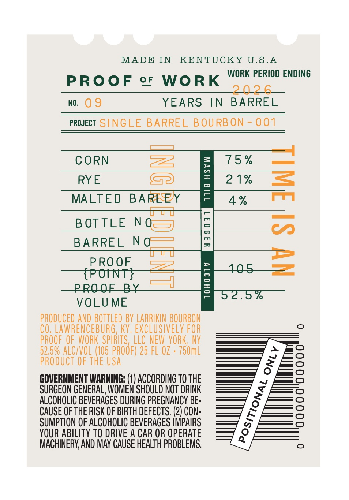
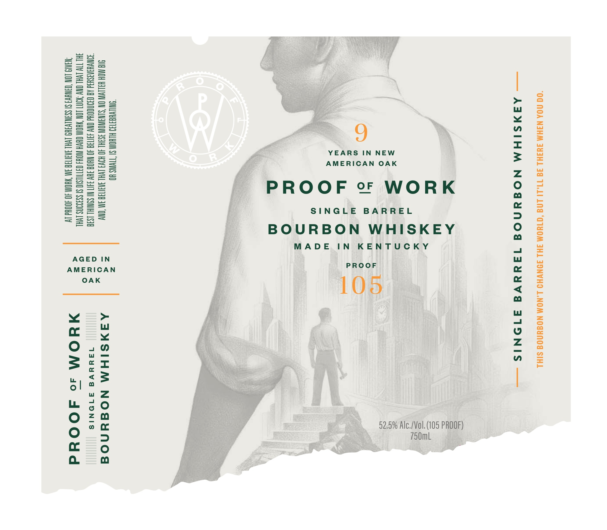
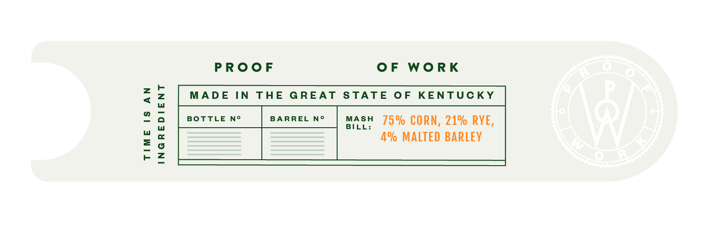
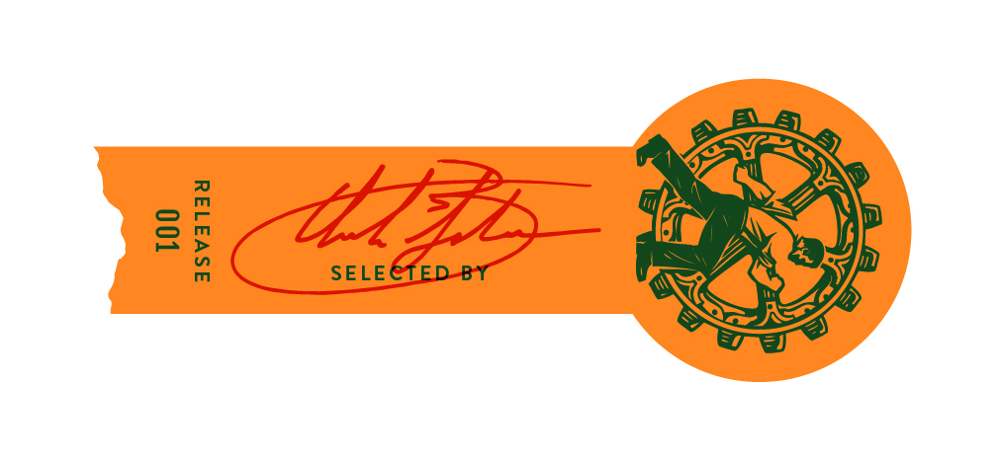

# TTB COLA Label Images - TTBID 26110001000379

**Brand Name:** PROOF OF WORK

**Fanciful Name:** SINGLE BARREL BOURBON

**Issue Date:** 05/29/2026

**Origin Code:** 22

**Product Class/Type:** 141

**Source:** [TTB Public COLA Registry](https://ttbonline.gov/colasonline/viewColaDetails.do?action=publicFormDisplay&ttbid=26110001000379)

## Label Images

### Back Label

### Front Label

### Label 2

### Label 3

## Extracted Label Text

*Text extracted via OCR - may contain errors*

*1 image(s) excluded: text did not meet readability threshold*

**Detected Proof:** 105

### Back Label

MADE IN KENTUCKY U.S.A

WORK PERIOD ENDING

PROOF oF WORK

&.

no. O9

YEARS IN BARREL

PRWECT SINGLE BARREL BOURBON - 001

[ee |

—

CORN

xs

15%

—

RYE

&2

21%

=

MALTED BAREPY

4%

Pm

BOTTLE NO—=

BARREL NOW

PROOF

==

=

VOLUME

PRODUCED AND BOTTLED BY LARRIKIN BOURBON

CO, LAWRENCEBURG, KY, EXCLUSIVELY FOR

PROOF OF WORK SPIRITS, LLC NEW YORK, NY

52.5% ALC/VOL (105 PROOF) 25 FL OZ + 750mL

PRODUCT 0

GOVERNMENT WARNING: (1) ACCORDING T0 THE

SURGEON GENERAL, WOMEN SHOULD NOT DRINK

ALCOHOLIC BEVERAGES DURING PREGNANCY BE-

CAUSE OF THE RISK OF BIRTH DEFECTS. (2) CON-

SUMPTION OF ALCOHOLIC BEVERAGES IMPAIRS

YOUR ABILITY TO DRIVE A CAR OR OPERATE

MACHINERY, AND MAY CAUSE HEALTH PROBLEMS.

### Front Label

“00 NOA N3HM 343HL 34 17,11 LN “C1HOM 3HL JONVHO L.NOM NOSYNOS SIHL

— AANSIHM NOGUNOG 14uaVA ATONIS —

“< > =
Wu =
eee =e
Oso ie
ue =
:;-Berre z
O22 wee tng O
cf Lk GO —
7< QO zMu
o’°&<
~s
oc o
fa a

“LLYHEET13) HLHOM SI TIVINS HO
SIG NOH HSLIVIV ON SLNSINOW 3S3HL 40 HOW LVHL 3030138 3M “ONY
TONWHSNASHSd AD CFNOOUd ONY 431738 40 WHOS JUV 3407 NI SOMIHL 1836
JHLTIW LVHL CNY 97 LON ‘YHOM CHYH WOKS QATILLSIO SI SS399NS LVHL
‘NBA LON “OINH] SI SSHNLVIHS LVHL 3031738 IM ‘YHOM 40 400Hd LV

AAMSIHM NOEAnNo|d

1de4dudVE ATONIS

HUYOM so JOOUd

AGED IN
AMERICAN
OAK

### Label 2

TIME 1S AN
INGREDIENT

PROOF

OF WORK

MADE IN THE GREAT STATE OF KENTUCKY

BOTTLE N°

BARREL N°

mas 75% CORN, 21% RYE,
4% MALTED BARLEY
