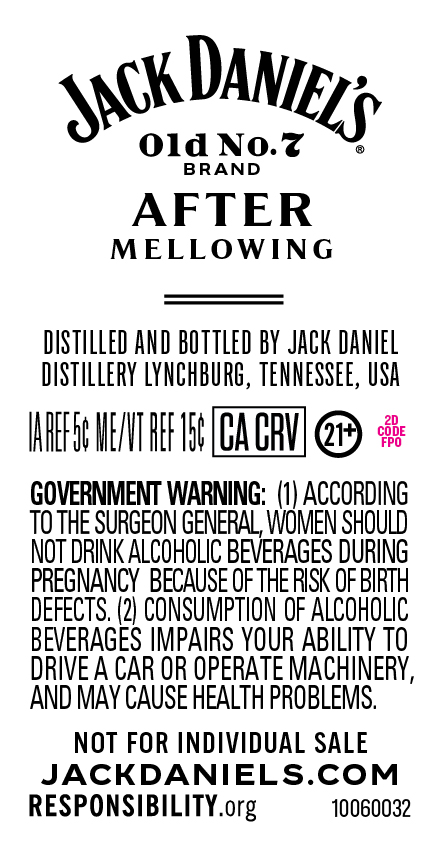
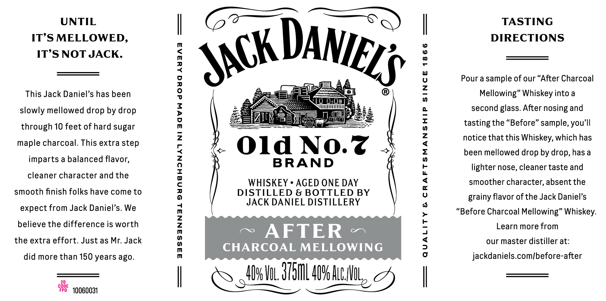

# TTB COLA Label Images - TTBID 26110001000380

**Brand Name:** JACK DANIEL'S

**Fanciful Name:** AFTER

**Issue Date:** 04/22/2026

**Origin Code:** 43

**Product Class/Type:** 140

**Source:** [TTB Public COLA Registry](https://ttbonline.gov/colasonline/viewColaDetails.do?action=publicFormDisplay&ttbid=26110001000380)

## Label Images

### Back Label

### Front Label

### Label 3

## Extracted Label Text

*Text extracted via OCR - may contain errors*

*1 image(s) excluded: text did not meet readability threshold*

### Back Label

Old No.z
BRAND
AFTER
MELLOWING
DISTILLED AND BOTTled BY JAck DaNIEL
DISTLleRY LYNCHBURG, TENNESSEE , USA
IAHEFE HEIT HEF ISF ALHUL
%38
GOVERNMENT WARNING;   (I) ACCORDING
TOTHE SURGEON GENERAL, WVOMEN SHOULD
NOT DRINK ALCOHOLIC BEVERAGES DURING
PREGNANCY  BECAUSE OF THERISK OF BIRTH
DEFECTS,
CONSUMPTION OF ALCOHOLIC
BEVERAGES IMPAIRS YOUR ABILITY TO
DRIVE A CAR OR OPERATE MACHINERY,
AND MAY CAUSE HEALTH PROBLEMS.
NOT FOR INDIVIDUAL SALE
JACKDANIELS.COM
RESPONSIBILITY.org
10060032
DANIELS
JACK

### Front Label

UNTIL
IT’S MELLOWED,
IT’S NOT JACK.

This Jack Daniel’s has been
slowly mellowed drop by drop
through 10 feet of hard sugar

maple charcoal. This extra step
imparts a balanced flavor,
cleaner character and the
smooth finish folks have come to
expect from Jack Daniel’s. We
believe the difference is worth
the extra effort. Just as Mr. Jack

did more than 150 years ago.

cone
Feo 10060031

SSSSANNAL SYNGHINATNIAGVW dowd AYSAa

/ Old NO.Z

BRAND

WHISKEY * AGED ONE DAY
DISTILLED & BOTTLED BY
JACK DANIEL DISTILLERY

~ AFTER ~

CHARCOAL MELLOWING

46601, 3751 40% Aue,

QUALITY & CRAFTSMANSHIP SINCE 1866

TASTING
DIRECTIONS

Pour a sample of our “After Charcoal
Mellowing” Whiskey into a
second glass. After nosing and
tasting the “Before” sample, you’ll
notice that this Whiskey, which has
been mellowed drop by drop, has a
lighter nose, cleaner taste and
smoother character, absent the
grainy flavor of the Jack Daniel’s

“Before Charcoal Mellowing” Whiskey.

Learn more from
our master distiller at:
jackdaniels.com/before-after
