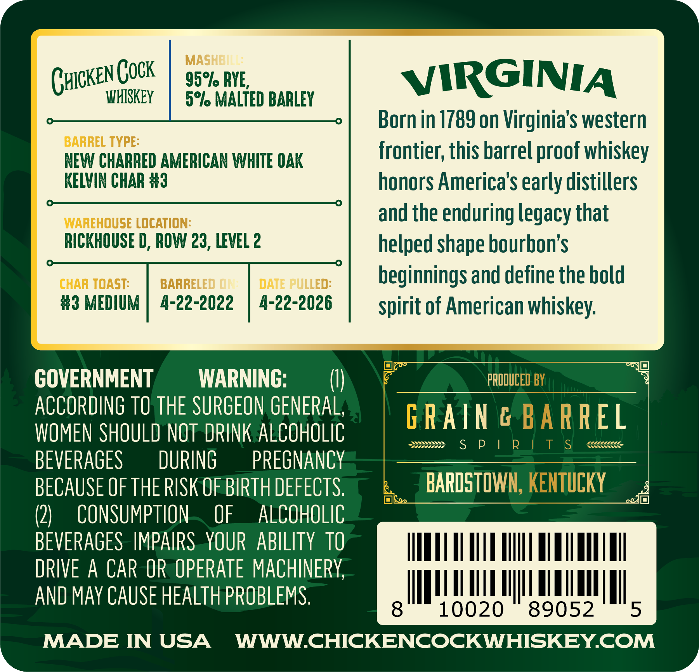
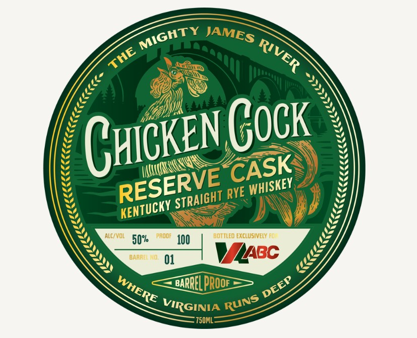

# TTB COLA Label Images - TTBID 26110001000501

**Brand Name:** CHICKEN COCK

**Issue Date:** 04/27/2026

**Origin Code:** 22

**Product Class/Type:** 102

**Source:** [TTB Public COLA Registry](https://ttbonline.gov/colasonline/viewColaDetails.do?action=publicFormDisplay&ttbid=26110001000501)

## Label Images

### Back Label

### Label 1

## Extracted Label Text

*Text extracted via OCR - may contain errors*

**Detected Proof:** 100

### Back Label

a

MASI
CHICKEN COCK | 959), pve
WHISKEY | 5°% MALTED BARLEY

BARREL TYPE:
NEW CHARRED AMERICAN WHITE OAK
KELVIN CHAR #3

WAREHOUSE LOCATION:
RICKHOUSE D, ROW 23, LEVEL 2

CHAR TOAST: | BARRELED DATE PULLED:
#3 MEDIUM | 4-22-2022 | 4-22-2026

GOVERNMENT WARNING:  (()
ACCORDING TO THE SURGEON GENERAL,
WOMEN SHOULD NOT DRINK ALCOHOLIC
BEVERAGES DURING — PREGNANCY
BECAUSE OF THE RISK OF BIRTH DEFECTS.
(2) CONSUMPTION. OF ALCOHOLIC
BEVERAGES IMPAIRS.YOUR ABILITY 10
DRIVE A CAR OR OPERATE MACHINERY,
AND MAY CAUSE HEALTH PROBLEMS.

VIRGINIA

Born in 1789 on Virginia's western
frontier, this barrel proof whiskey
honors America’s early distillers
and the enduring legacy that
helped shape bourbon’s
beginnings and define the bold
spirit of American whiskey.

PRI

PAIN | EL

ssp CS CPC eee

BARDSTOV -_

nba

MADE IN USA WWW.CHICKENCOCKWHISKEY.COM

J

### Label 1

Chcken Gock
RYE
ALC /Vol
50%
PadoF
J00
bottled exclusIVELY FO
BAAA
01
ZBC
BARRELprooe
VIRGINIA
"750ML
MIGHTY
JAMES
RIVER
THE
CASK
RESERVE'
WHISKEY
STRAIGHT
KENTUCKY
DEEP
WHERE
RUNS
