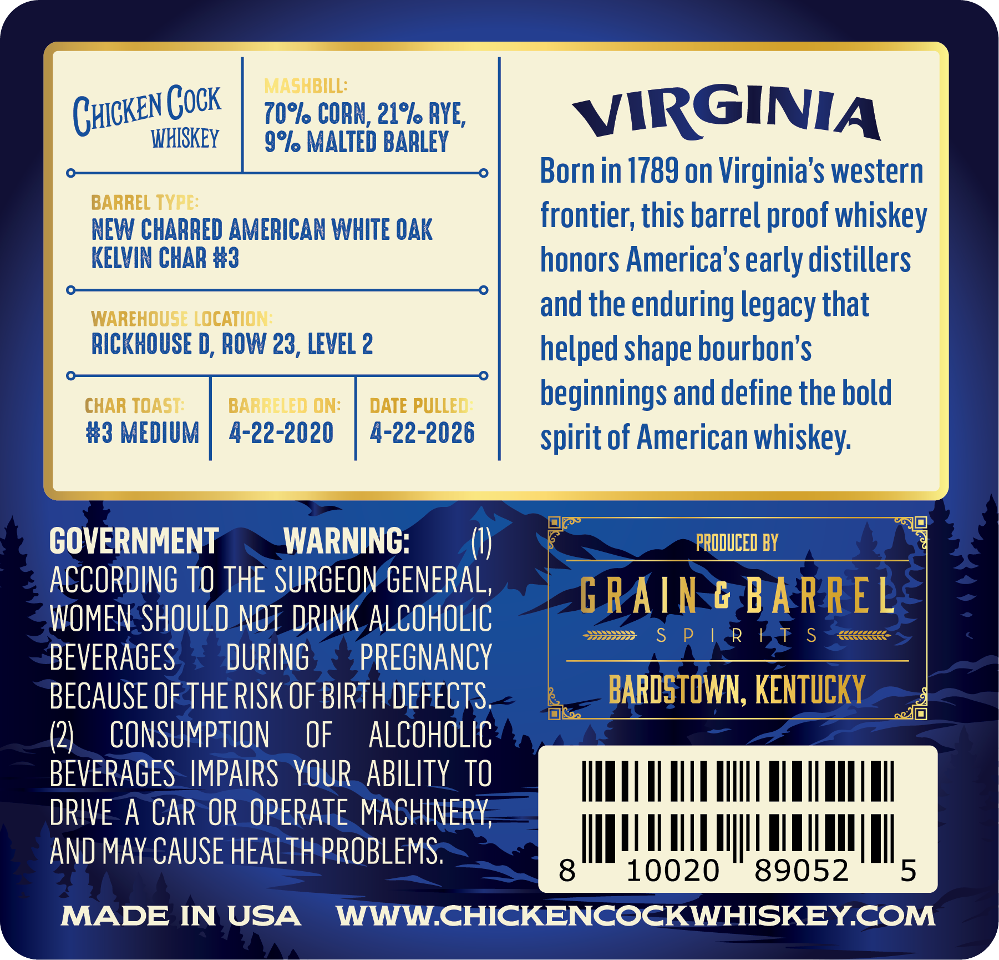

# TTB COLA Label Images - TTBID 26110001000505

**Brand Name:** CHICKEN COCK

**Issue Date:** 04/27/2026

**Origin Code:** 22

**Product Class/Type:** 101

**Source:** [TTB Public COLA Registry](https://ttbonline.gov/colasonline/viewColaDetails.do?action=publicFormDisplay&ttbid=26110001000505)

## Label Images

### Back Label

## Extracted Label Text

*Text extracted via OCR - may contain errors*

### Back Label

MASHBILL:
Ghicken Gock
z0%1 CORN, 21% BYE,
VIRGINIA
WHISKEY
9%l MALTED BARLEY
Born in 1789 on Virginia's western
BARREL TYPE:
NEW CHARRED AMERICAN WHITE OAK
frontier; this barrelproof whiskey
KELVIN CHAR #3
honors America's early distillers
WAREHOUSE LOCATION:
and the enduring legacy that
RICKHOUSE D, ROW 23, LEVEL 2
helped shape bourbon's
CHAR TOAST:
BARRELED ON:
DATE PULLED
beginnings and define the bold
#3 MEDIUM
4-22-2020
4-22-2026
spirit of American whiskey:
GOVERNMENT
WARNING:
PRODUCED BY
ACCORDING TO THE SURGEON GENERAL,
G RAIN & BARREL
WOMEN SHOULD NOT DRINK ALCOHOLIC
S
P
~R
FT
S
BEVERAGES
DURING
PREGNANCY
BECAUSE OF THE RISK OF BIRTH DEFECTS
BARDSTOWN, KENTUCKY
(2)
CONSUMPTION
OF
ALCOHOLIC
BEVERAGES IMPAIRS   YOUR  ABILITY tTO
DRIVE A CAR OR OPERATE MACHINERY
AND MAY CAUSE HEALTH PROBLEMS;
8
10020
89052
5
MADE IN USA
WWWCHICKENCOCKWHISKEYCOM
