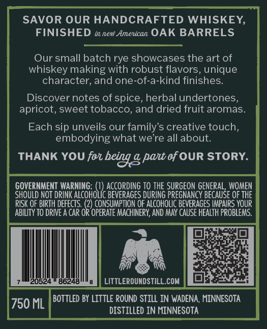
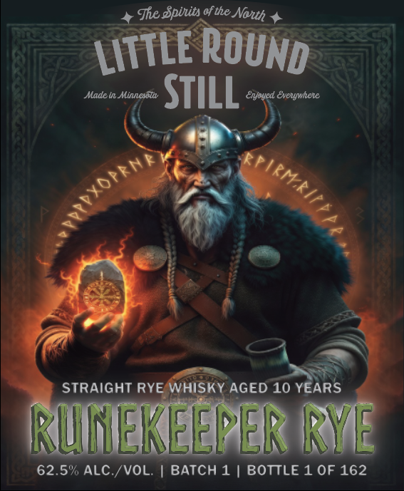

# TTB COLA Label Images - TTBID 26110001000511

**Brand Name:** LITTLE ROUND STILL

**Issue Date:** 04/27/2026

**Origin Code:** 27

**Product Class/Type:** 102

**Source:** [TTB Public COLA Registry](https://ttbonline.gov/colasonline/viewColaDetails.do?action=publicFormDisplay&ttbid=26110001000511)

## Label Images

### Back Label

### Front Label

## Extracted Label Text

*Text extracted via OCR - may contain errors*

**Detected Proof:** 125
**Detected Age:** 10 Years

### Back Label

SAVOR OUR HANDCRAFTED WHISKEY,
FINISHED azewAmevican OAK BARRELS
Our small batch rye showcases the art of

whiskey making with robust flavors, unique
character, and one-of-a-kind finishes.
Discover notes of spice, herbal undertones,
apricot, sweet tobacco, and dried fruit aromas.
Each sip unveils our family’s creative touch,
embodying what we're all about.
THANK YOU for being 2 part of OUR STORY.
GOVERNMENT WARNING: {i ACCORDING TO THE SURGEON GENERAL, WOMEN
SHOULD NOT DRINK ALCOHOLIC BEVERAGES DURING PREGNANCY BECAUSE OF THE
RISK OF BIRTH DEFECTS. () CONSUMPTION OF ALCOHOLIC BEVERAGES IMPAIRS YOUR
ABILITY TO DRIVE A CAR OR OPERATE MACHINERY, AND MAY CAUSE HEALTH PROBLEMS.
2 [OR terry
eaten
ea
Pee LITTLeRouNosTiLt.com | MER EAA
750 ML BOTTLED BY LITTLE ROUND STILL IN WADENA, MINNESOTA
DISTILLED IN MINNESOTA

### Front Label

Mhe Spiits of the
Made In Minnesold
StILL
Enoyed Eveuywhene
STRAIGHT RYE WHISKY AGED 10 YEARS
RUNEKEEPER RYE
62.5% AlC /VOL
BATCH 1 | BOTTLE 1 OF 162
Nouh
ROUND
LITTLE
KFIRMKIF PA
tPyopRNA
