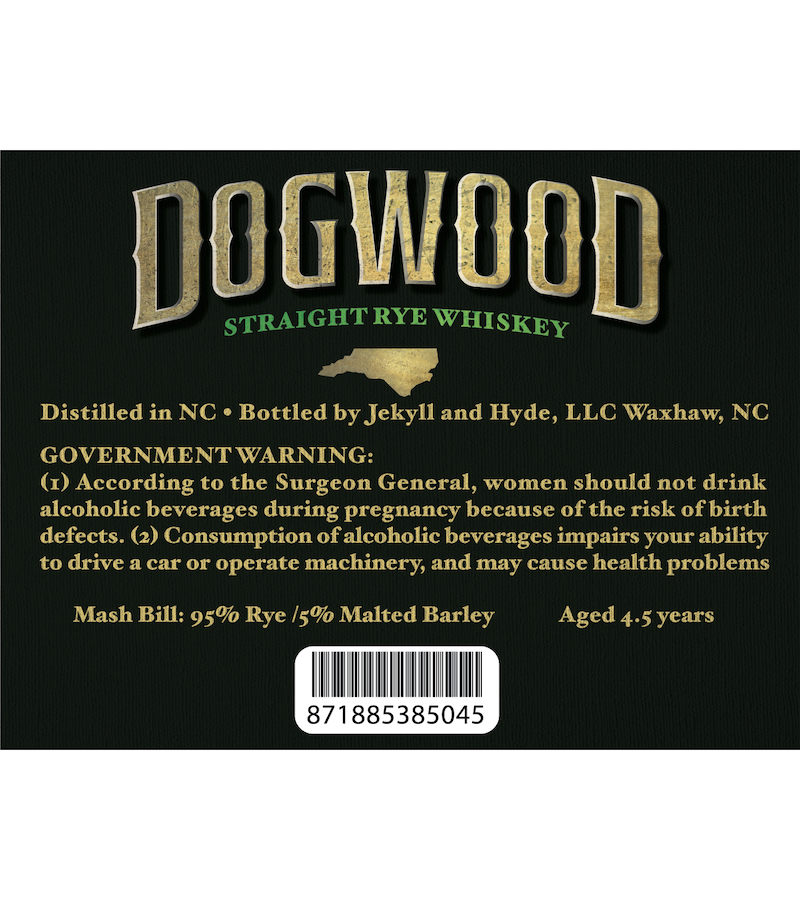
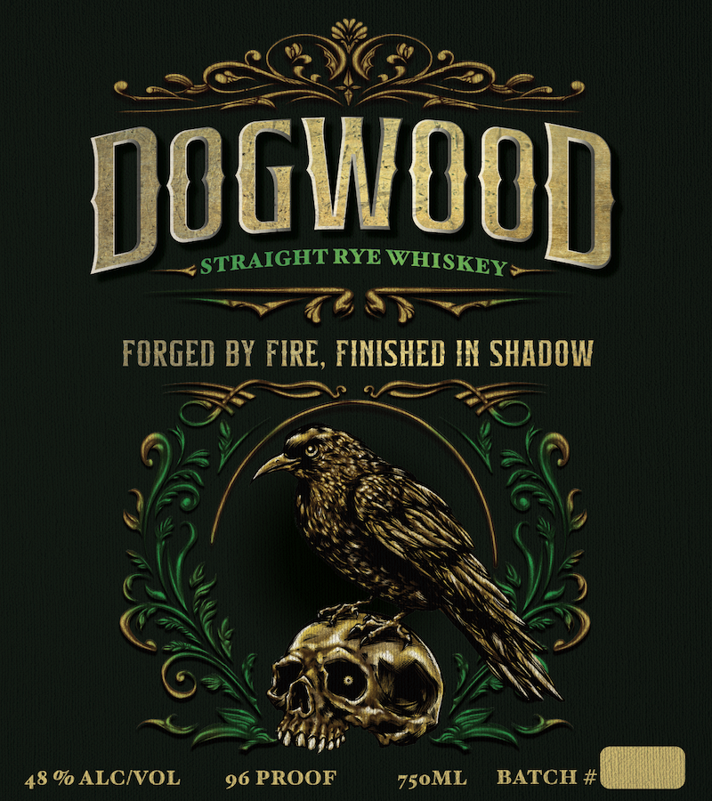

# TTB COLA Label Images - TTBID 26110001000540

**Brand Name:** DOGWOOD

**Fanciful Name:** STRAIGHT RYE WHISKEY

**Issue Date:** 04/23/2026

**Origin Code:** 35

**Product Class/Type:** 102

**Source:** [TTB Public COLA Registry](https://ttbonline.gov/colasonline/viewColaDetails.do?action=publicFormDisplay&ttbid=26110001000540)

## Label Images

### Back Label

### Front Label

## Extracted Label Text

*Text extracted via OCR - may contain errors*

**Detected Proof:** 96
**Detected Age:** 4.5 Years

### Back Label

dogwood
STRAIGHTRYE
Distilled in NC o Bottled by Jekyll and Hyde, LLC Waxhaw, NC
GOVERNMENT WARNING:
(1)
According to the Surgeon General, women should not drink
alcoholic beverages during pregnancy because ofthe risk ofbirth
defects. (2) Consumption ofalcoholic beverages impairs your ability
to drive a car or operate
machinery and may cause health problems
Mash Bill: 950 Rye
Malted Barley
Aged 4.5 years
871885385045
WHISKEY
15%

### Front Label

Dogwood
STRAIGHT)
RYE
FORGED BY FIRE, FINISHED IN SHADOW
48 % ALCIVOL
96 PROOF
750ML
BATCH #
WHISKEY
