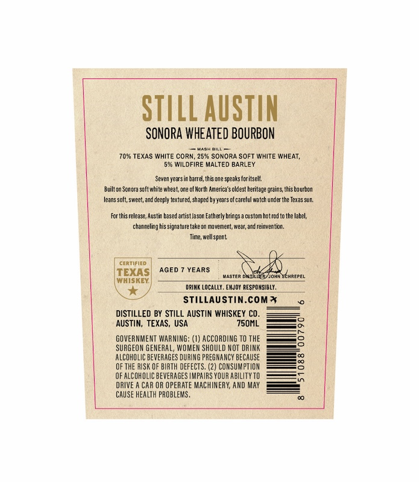
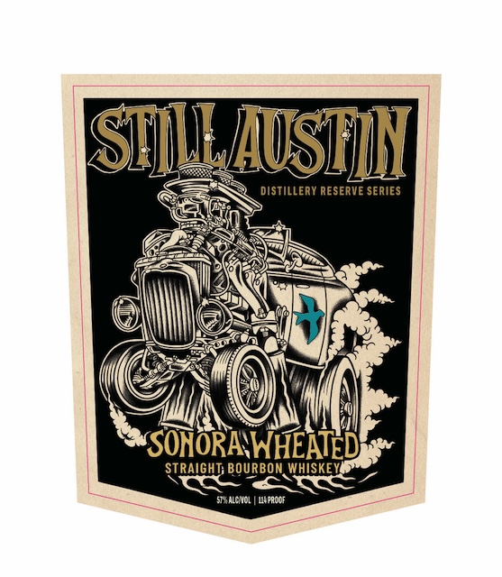
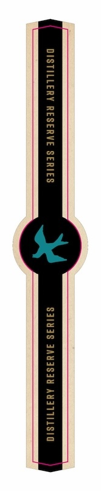

# TTB COLA Label Images - TTBID 26110001000662

**Brand Name:** STILL AUSTIN

**Fanciful Name:** DISTILLERY RESERVE SERIES

**Issue Date:** 04/23/2026

**Origin Code:** 44

**Product Class/Type:** 101

**Source:** [TTB Public COLA Registry](https://ttbonline.gov/colasonline/viewColaDetails.do?action=publicFormDisplay&ttbid=26110001000662)

## Label Images

### Back Label

### Front Label

### Label 3

## Extracted Label Text

*Text extracted via OCR - may contain errors*

*1 image(s) excluded: text did not meet readability threshold*

### Back Label

STILL AUSTIN
SONORA WHEATED BOURBON
70%6 TEXAS WHITE CORN, 252 SonoRA Soft White WHEAT,
536 WILdFiRE MALTED BARLEY
Seven yearsin barrel, this one speaks foritseli
Built on Scnora solt write wheat;or ? of Mcrlh America $ cldest
grains; this Ejurbom
leans scft; sweet, and deeply texturec,shap20 byyears =
careful watch unce the T2xas SUM:
FortFis release, Austin tased arist lason Fatherly brings
custom hotrodto the Iabel;
channeling his signature take on movement; wear,and feinventin,
Timz; wellspent
Cartirind
TEXAS
AGED
YEARS
VASTFR DiI
MiohyschrepeL
WHISKEY:
dRimk Locally, EmJoy RESFOMSIBLY ,
STIlLAUSTin.com *
DISTILLED BY STILL AUSTIN WHISKEY CO
AUSTIN, TEXAS, USA
750ML
GOVERNMENT WARNING: (1) ACCORDING TO THE
8
SURGEOM GEMERAL, WOMEM ShOULD MOT DRINK
alcoholic beweraGeS DURING preGMAnCY BECAUSE
QF thE RISK QF BIRTH defectS. (2) CONSUMPTIOM
OF ALCOhOLIC beveRAGES |MPAIRS YOUR AbILITYtO
DRIVE
CAR OR OPERATE MAchINERY; AND May
CAUSE HEALTH PROBLEMS _
beniajeF

### Front Label

SIUUSIM
DISTILLERY RESERVE SERIES
'SONORAVWHEATED
STRAIGHT; BOURBON WHISKEY _
SrMcT0L
WifadoF
