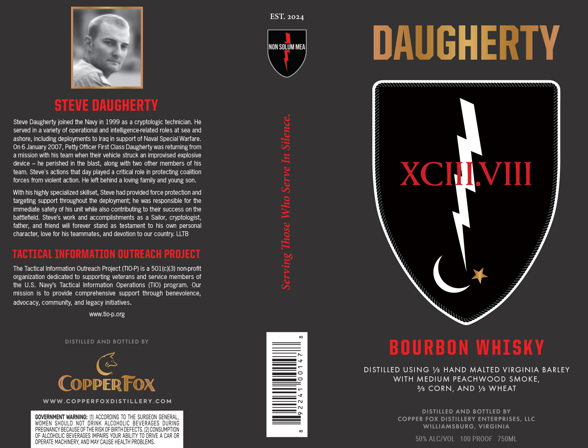

# TTB COLA Label Images - TTBID 26110001000675

**Brand Name:** DAUGHERTY

**Issue Date:** 04/23/2026

**Origin Code:** 05

**Product Class/Type:** 141

**Source:** [TTB Public COLA Registry](https://ttbonline.gov/colasonline/viewColaDetails.do?action=publicFormDisplay&ttbid=26110001000675)

## Label Images

### Front Label

## Extracted Label Text

*Text extracted via OCR - may contain errors*

**Detected Proof:** 100

### Front Label

EST: 2024
MOM SOLUM MEA
DAUGHERTY
STEVE DAUGHERTY
Steve Daugherty joined the
999 as a cryptologic technician: He
served in
variety of operational
intelligence-related roles at sea and
4
ashore
including deployments to Iraq in support of Naval Special Warfare.
On 6 January 2007, Petty Officer First Class Daugherty was returning from
a mission with his team when their vehicle struck an improvised explosive
device
he perished in the blast; along with two other members of his
1
team: Steve'$ actions that day played a critical role in protecting coalition
XCHVIII
forces from violent action: He left behind a loving family and young son:
3
With his highly specialized skillset; Steve had provded force protection and
targeting support throughout the deployment; he was responsible for the
immediate safety of his unit while also contributing to their success on the
2
battlefield. Steve's work and accomplishments as a Sailor, cryptologist,
father, and friend will forever  stand as testament to his own personal
character; love for his teammates;
and devotion to our country: LLTB
8
TACTICAL INFORMATION OUTREACH PROJECT
The Tactical Information Outreach Project (TIO-P) is a 501(c)(3) non-profit
{
organization dedicated to supporting veterans and service members of
the U.S. Navy's Tactical Information  Operations (TIO) program: Our
mission is to provide comprehensive support through benevolence
advocacy; community; and legacy initiatives.
WWW_
tio-p.org
DISTILLED AND BOTTLED BY
BOURBON WHISKY
DI STILLED USING Vs HAND MALTED VIRGINIA BARLEY
WITH MEDIUM PEACHWOOD SMOKE,
COPPERFOX
3/5 CORN,
AND Vs WHEAT
WWW.COPPERFOXDISTILLERY.COM
DISTiLLEd AND BOTTLED BY
GOVERNMENT WARNING:
ACCORDING To ThE SURGEON GENERAL
COPPER FOX DISTILLERY ENTERPRISES, LLC
Women ShoULd Not drink ALCOHOLIC_BEVERAGES DURING
WILLIAMSBURG, VIRGiNIA
PREGNANCY BECAUSE OFTheRISK OF BiRTH deFECTS: [2]ConsumptION
QF ALCOHOLIC BEVERAGES IMPAIRS YOUR ABILITY TO DRIVE
CAR OR
OPERATE MACHINERY, AND MAY CAUSE HEALTH PROBLEMS ,
50% ALC/VOL
100 PROOF
750ML
Navy
and
