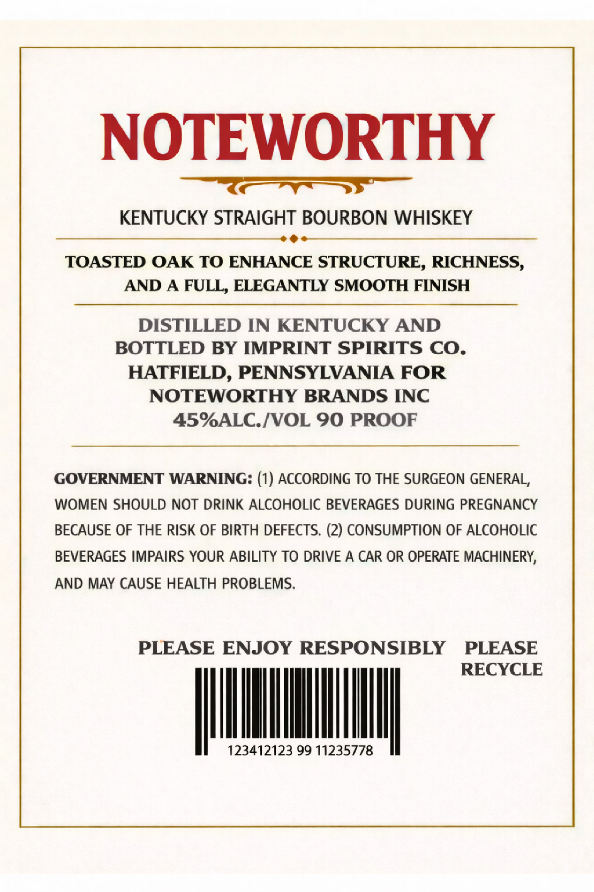
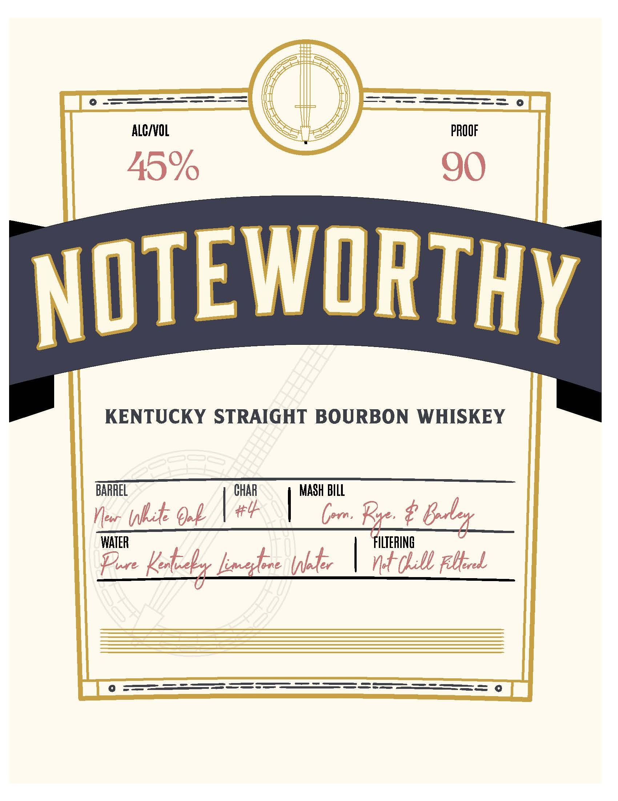

# TTB COLA Label Images - TTBID 26111001000004

**Brand Name:** NOTEWORTHY

**Issue Date:** 04/25/2026

**Origin Code:** 39

**Product Class/Type:** 101

**Source:** [TTB Public COLA Registry](https://ttbonline.gov/colasonline/viewColaDetails.do?action=publicFormDisplay&ttbid=26111001000004)

## Label Images

### Back Label

### Label 1

## Extracted Label Text

*Text extracted via OCR - may contain errors*

**Detected Proof:** 90

### Back Label

NOTEWORTHY
KENTUCKY STRAIGHT BOURBON WHISKEY
TOASTED OAK TO ENHANCE STRUCTURE, RICHNESS,
AND A FULL, ELEGANTLY SMOOTH FINISH
DISTILLED IN KENTUCKY AND
BOTTLED BY IMPRINT SPIRITS CO.
HATFIELD, PENNSYLVANIA FOR
NOTEWORTHY BRANDS INC
45%ALC.[VOL 90 PROOF
GOVERNMENT WARNING: (1) ACCORDING TO THE SURGEON GENERAL,
WOMEN SHOULD NOT DRINK ALCOHOLIC BEVERAGES DURING PREGNANCY
BECAUSE OF THE RISK OF BIRTH DEFECTS. (2) CONSUMPTION OF ALCOHOLIC
BEVERAGES IMPAIRS YOUR ABILITY TO DRIVE A CAR OR OPERATE MACHINERY;
AND MAY CAUSE HEALTH PROBLEMS.
PLEASE ENJOY RESPONSIBLY
PLEASE
RECYCLE
123412123 99 11235778

### Label 1

KENTUCKY STRAIGHT BOURBON WHISKEY

BARREL CHAR | MASH BILL

Now hte Ook NP \ Com Rye é Goeley
WATER ILTERING
Fe Keb mahee hte | at Lill bel
