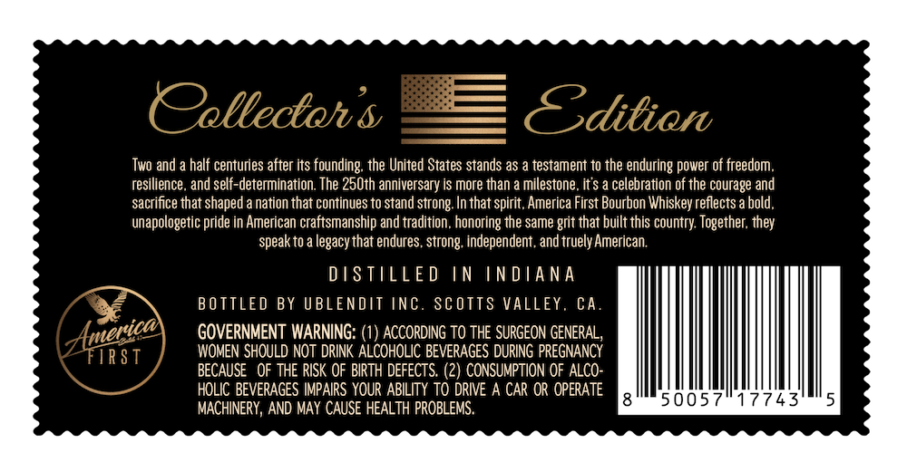
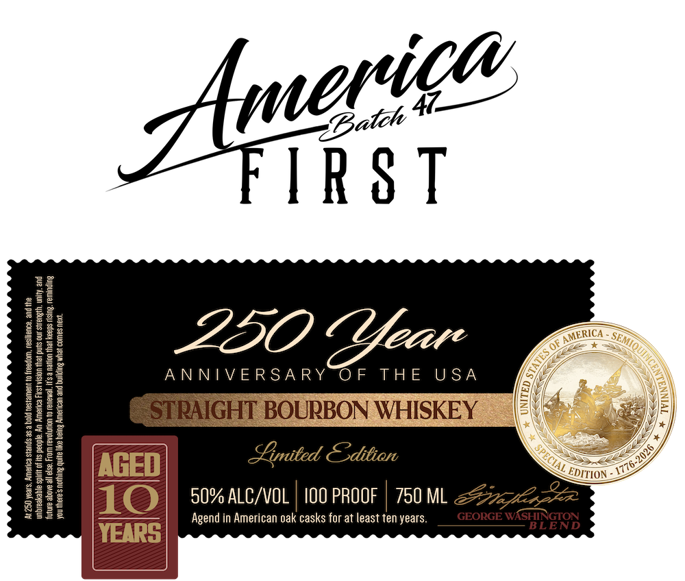

# TTB COLA Label Images - TTBID 26111001000023

**Brand Name:** AMERICA FIRST

**Issue Date:** 04/24/2026

**Origin Code:** 01

**Product Class/Type:** 101

**Source:** [TTB Public COLA Registry](https://ttbonline.gov/colasonline/viewColaDetails.do?action=publicFormDisplay&ttbid=26111001000023)

## Label Images

### Back Label

### Label 1

## Extracted Label Text

*Text extracted via OCR - may contain errors*

**Detected Proof:** 100

### Back Label

Oelledtoh $
Editien
Two and
half centuries after its founding; the United States stands as
testament to the enduring power of freedom,
resilience , and self-determination. The 25Oth anniversary is more than
milestone , it $ a celebration of the courage and
sacrifice that shaped
nation that continues to stand strong: In that spirit, America First Bourbon Whiskey reflects a bold ,
unapologetic pride in American craftsmanship and tradition , honoring the same grit that built this country Together; they
speak to a legacythat endures , strong: independent , and truely American.
D S TILLE D
IN
IN DA NA
BO TTLED BY UBLENDIT inC.
ScOTTS VALLEY. CA.
GOVERNMENT WARNING: (1) ACCORDING TO THE SURGEON GENERAL
TTR S T
WOMEN SHOULD NOT DRINK ALCOHOLIC BEVERAGES DURING PREGNANCY
BECAUSE   OF THE RISK OF BIRTH DEFECTS. (2) CONSUMPTION OF ALCO
HOLIC BEVERAGES IMPAIRS YOUR ABILITY TO DRIVE A CAR OR OPERATE
500571
7743
MACHINERY, AND MAY CAUSE HEALTH PROBLEMS.
America]

### Label 1

G—

IRST

ERI

__

L220

OF THE USA

ANNIVERSARY

iT BOURBON WHISKEY

Limited Codition

AGED

ION

10

Agend in American oak casks for at least ten years.

50% ALC/VOL | 100 PROOF | 750 M

YEAR
