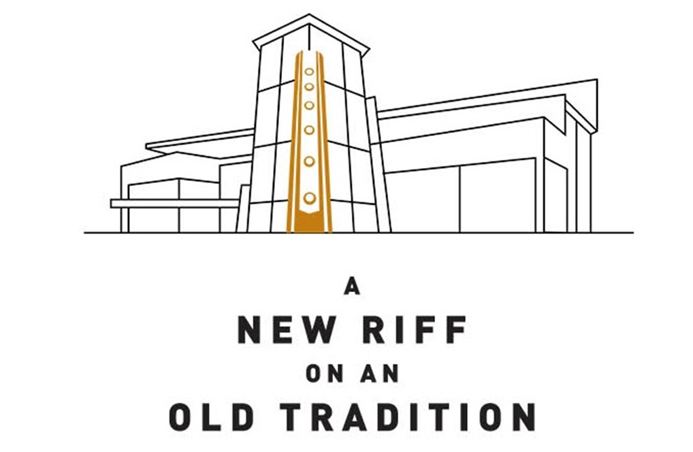
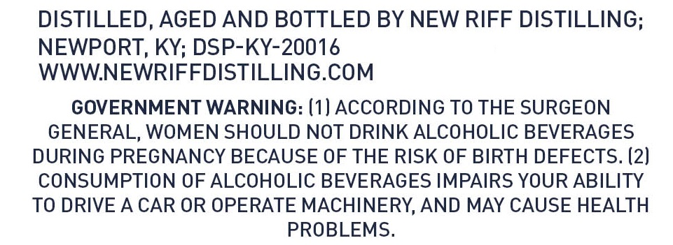

# TTB COLA Label Images - TTBID 26111001000079

**Brand Name:** NEW RIFF

**Issue Date:** 04/22/2026

**Origin Code:** 22

**Product Class/Type:** 111

**Source:** [TTB Public COLA Registry](https://ttbonline.gov/colasonline/viewColaDetails.do?action=publicFormDisplay&ttbid=26111001000079)

## Label Images

### Back Label

### Front Label

### Label 4

## Extracted Label Text

*Text extracted via OCR - may contain errors*

*1 image(s) excluded: text did not meet readability threshold*

### Back Label

ty

nee

Nem

NEW RIFF

ON AN

OLD TRADITION

### Label 4

DISTILLED, AGED AND BOTTLED BY NEW RIFF DISTILLING;

NEWPORT, KY; DSP-KY-20016

WWW.NEWRIFFDISTILLING.COM

GOVERNMENT WARNING: (1] ACCORDING TO THE SURGEON

GENERAL, WOMEN SHOULD NOT DRINK ALCOHOLIC BEVERAGES

DURING PREGNANCY BECAUSE OF THE RISK OF BIRTH DEFECTS. (2)

CONSUMPTION OF ALCOHOLIC BEVERAGES IMPAIRS YOUR ABILITY

TO DRIVE A CAR OR OPERATE MACHINERY, AND MAY CAUSE HEALTH

PROBLEMS.
