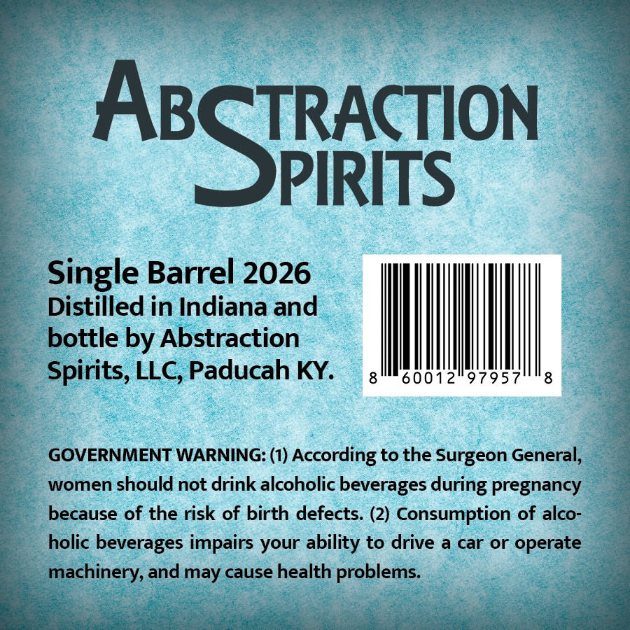
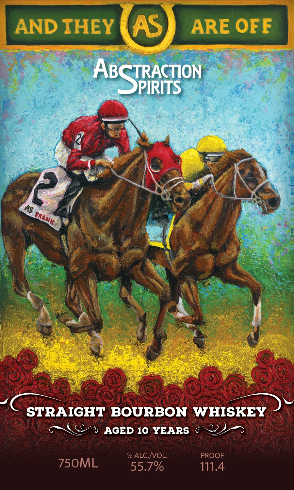

# TTB COLA Label Images - TTBID 26111001000117

**Brand Name:** ABSTRACTION SPIRITS

**Fanciful Name:** AND THEY ARE OFF

**Issue Date:** 04/22/2026

**Origin Code:** 22

**Product Class/Type:** 101

**Source:** [TTB Public COLA Registry](https://ttbonline.gov/colasonline/viewColaDetails.do?action=publicFormDisplay&ttbid=26111001000117)

## Label Images

### Back Label

### Front Label

## Extracted Label Text

*Text extracted via OCR - may contain errors*

**Detected Proof:** 111.4
**Detected Age:** 10 Years

### Back Label

TRACTION

Aq

PIRITS

Single Barrel 2026

Distilled in Indiana and

bottle by Abstraction

I

Spirits, LLC, Paducah KY.

|

60012°97957

8

GOVERNMENT WARNING: (1) According to the Surgeon General,

women should not drink alcoholic beverages during pregnancy

because of the risk of birth defects. (2) Consumption of alco-

holic beverages impairs your ability to drive a car or operate

pchinety, and may cause health problerie

### Front Label

AND IHEY
AS
ARE OFF
AbSmacon
P
RS
STRAIGHT BOURBON WHISKEY
AGED 10 YEARS
% ALC NOL
PROOF
750ML
55.7%
111.44
ERANK
