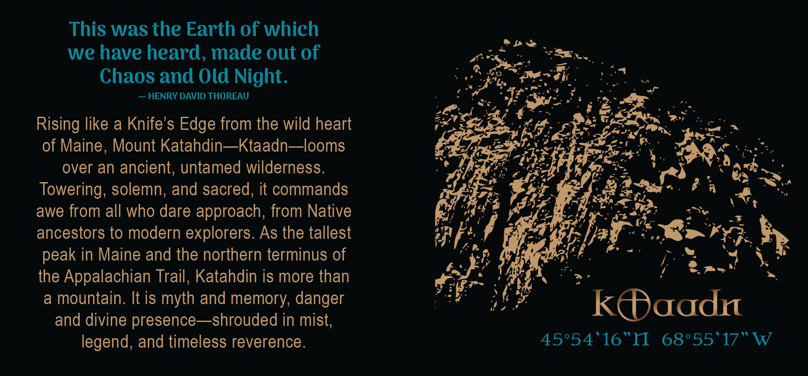
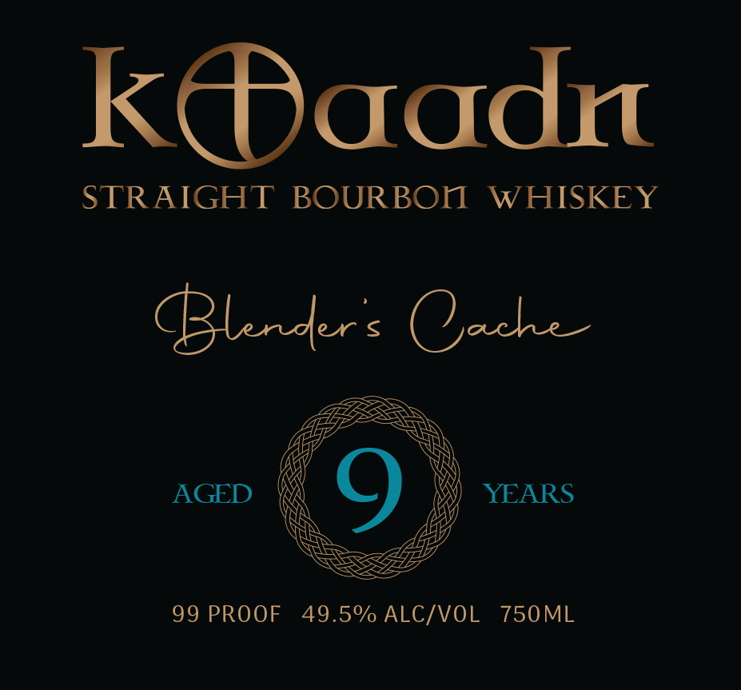
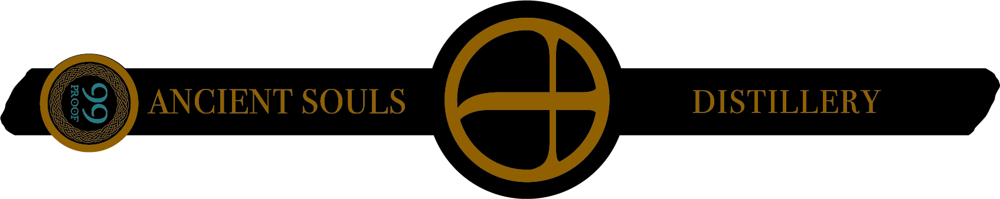

# TTB COLA Label Images - TTBID 26111001000261

**Brand Name:** KTAADN

**Issue Date:** 04/22/2026

**Origin Code:** 24

**Product Class/Type:** 101

**Source:** [TTB Public COLA Registry](https://ttbonline.gov/colasonline/viewColaDetails.do?action=publicFormDisplay&ttbid=26111001000261)

## Label Images

### Back Label

### Front Label

### Label 4

## Extracted Label Text

*Text extracted via OCR - may contain errors*

*1 image(s) excluded: text did not meet readability threshold*

**Detected Proof:** 99
**Detected Age:** 9 Years

### Back Label

This was the Earth of which
we have heard, made out of
Chaos and Old Night.
HENRY DAVID THOREAU
Rising like a Knife's Edge from the wild heart
of Maine, Mount Katahdin_Ktaadn~looms
over an ancient, untamed wilderness.
Towering; solemn; and sacred, it commands
awe from all who dare approach; from Native
ancestors to modern explorers As the tallest
peak in Maine and the northern terminus of
the Appalachian Trail, Katahdin is more than
a
mountain. It is myth and memory; danger
KQaadn
and divine presence
shrouded in mist;
legend, and timeless reverence.
45*54'16"II
68055'17"W

### Front Label

Kaadn
STRAIGHT
BOURBOn
WHISKEY
Blnders Qache
AGED
9
YEARS
99 PROOF
49.5%/ ALC/VOL
750ML
