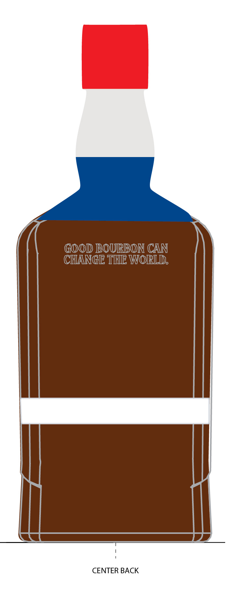
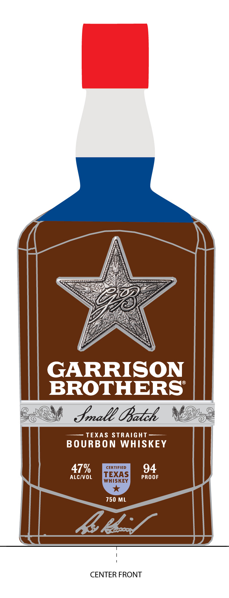
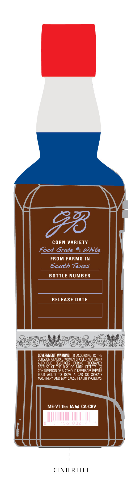
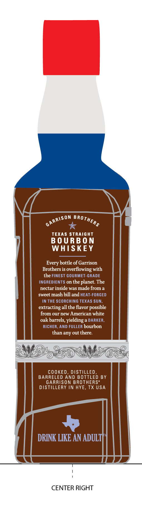

# TTB COLA Label Images - TTBID 26111001000315

**Brand Name:** GARRISON BROTHERS

**Fanciful Name:** SMALL BATCH

**Issue Date:** 04/23/2026

**Origin Code:** 44

**Product Class/Type:** 101

**Source:** [TTB Public COLA Registry](https://ttbonline.gov/colasonline/viewColaDetails.do?action=publicFormDisplay&ttbid=26111001000315)

## Label Images

### Back Label

### Front Label

### Label 3

### Label 4

## Extracted Label Text

*Text extracted via OCR - may contain errors*

**Detected Proof:** 94

### Back Label

GOOD BOURBON CAN
CHANGE THE WORLD,

CENTER BACK

### Front Label

GARRISON
BROTHERS
Jrall UBatzh
TEXAS StrAiGHT
B O URBON WHISKEEY
47%
CERTIFIED
94
ALCIVOL
TEXAS
PROOF
WHISKEY
750 ML
4e.
CENTER FRONT

### Label 3

CORN VARIETY
Food Grade
White
FROM FARMS IN
South Texas
BOTTLE NUMBER
RELEASE DATE
GOVERNMENT  WARNING; (1)
LJFCorDwor
OHHE
SURGEON GENERAL; WOMEN
NOT
ALCOHOLIC
BEVERAGES
DURING
PREGNANCY
BECAUSE OF THERISK OF  BIRTH  DEFECTS;
CONSUMPTION OF ALCOHOLIC BEVERAGES IMPAIRS
YOUR   ABILITY TO  DRIVE
CAR OR  OPERATE
MACHINERY; AND MAY CAUSE HEALTH PROBLEMS,
ME-VT 1Sc IA Sc CA-CRV
CENTER LEFT

### Label 4

TEXAS StraighT
B 0 U RB 0 N
WHISKEY
Every bottle of Garrison
Brothers is
overflowing with
the FINEST GOURMET-GRADE
INGREDIENTS on the planet  The
nectar inside was made from a
sweet mash bill and HEAT-FORGED
IN THE SCORCHING TEXAS SUN;
extracting all the flavor possible
from our new American white
oak barrels, yielding a DARKER ,
RICHER, AND FULLER bourbon
than any out there:
COOKED, DISTILLED,
BARRELED AND BOTTLED BY
GARRISON BROTHERS"
DISTILLERY IN HYE, TX USA
DRINK LIKE AN ADULTF
CENTER RIGHT
GARRISON
BROTHERS
