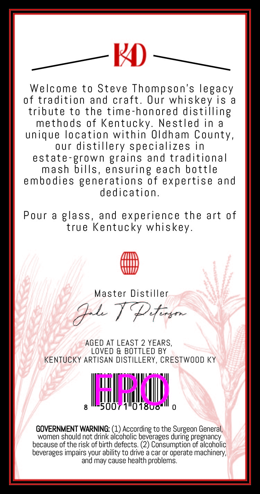
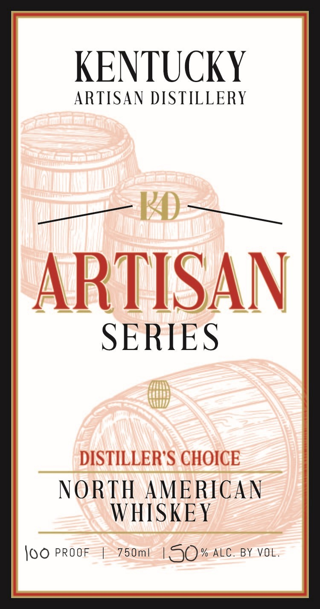

# TTB COLA Label Images - TTBID 26111001000355

**Brand Name:** ARTISAN SERIES

**Fanciful Name:** DISTILLERS CHOICE

**Issue Date:** 04/22/2026

**Origin Code:** 22

**Product Class/Type:** 140

**Source:** [TTB Public COLA Registry](https://ttbonline.gov/colasonline/viewColaDetails.do?action=publicFormDisplay&ttbid=26111001000355)

## Label Images

### Back Label

### Front Label

### Label 4

## Extracted Label Text

*Text extracted via OCR - may contain errors*

*1 image(s) excluded: text did not meet readability threshold*

**Detected Proof:** 150
**Detected Age:** 2 Years

### Back Label

Welcome to Steve Thompson's legacy

of tradition and craft. Our whiskey is a

tribute to the time-honored distilling

methods of Kentucky. Nestled ina

unique location within Oldham County,

our distillery specializes in

estate-grown grains and traditional

mash bills, ensuring each bottle

embodies generations of expertise and

dedication.

Pour a glass, and experience the art of

true Kentucky whiskey.

B

Master Distiller

GLT Poor

AGED AT LEAST 2 YEARS,

LOVED & BOTTLED BY

KENTUCKY ARTISAN DISTILLERY, CRESTWOOD KY

ON.

GOVERNMENT WARNING: (1) According to the Surgeon General,

women should not drink alcoholic beverages during pregnancy

because of the risk of birth defects. (2) Consumption of alcoholic

beverages impairs your ability to drive a car or operate machinery,

and may cause health problems.

### Front Label

KENTUCKY
ARTISAN DISTILLERY
ARTISAN
SERIES
DISTILLER'S CHOICE
NORTH
AMERICAN
WHISKEY
loo PROOF
75 0ml
150
% ALC.
BY VOL.
