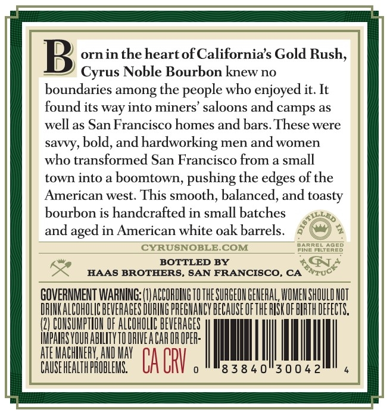

# TTB COLA Label Images - TTBID 26111001000437

**Brand Name:** CYRUS NOBLE

**Issue Date:** 04/22/2026

**Origin Code:** 01

**Product Class/Type:** 141

**Source:** [TTB Public COLA Registry](https://ttbonline.gov/colasonline/viewColaDetails.do?action=publicFormDisplay&ttbid=26111001000437)

## Label Images

### Back Label

## Extracted Label Text

*Text extracted via OCR - may contain errors*

### Back Label

B
ornin the heartofCalifornias Gold Rush,
Cyrus Noble Bourbon knew no
boundaries among the people who enjoyed it: It
found its way into miners' saloons and camps as
well as San Francisco homes and bars. These were
savvy, bold, and hardworking men and women
who transformed San Francisco from a small
town into a boomtown, pushing the
of the
American west: This smooth; balanced, and toasty
bourbon is handcrafted in small batches
and
in American white oak barrels
CYRUSNOBLE COM
ERED
BOTTLED
BY
HAAS BROTHERS, SAN FRANCISCO, CA
GQVERNMENT WARMIG LLACCORUINGILTHE SUAGEQHGEHEHAL WUMEHSHOULIHOT
DRIHKALCOHOLCHEVERAGES DURING PREGHANCY HEGAUSEOFTHERISK OF BIRTH DEFECTS,
COHSUMPTHOH DF ALCOHULIC BEVERAGES
IMPHIRS VQUR ABILITYTO DRIVEA CAR OR OPER:
ATE MACHINERV, AND May
CAUSE HEALTH PROBLEHS
CA ORV
'8 3 8 4 0"30 0 4 2
edges
aged
GNTUO
