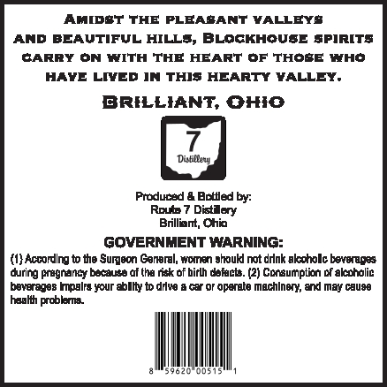
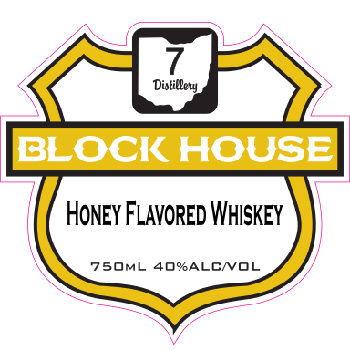

# TTB COLA Label Images - TTBID 26111001000496

**Brand Name:** BLOCK HOUSE

**Issue Date:** 04/30/2026

**Origin Code:** 09

**Product Class/Type:** 149

**Source:** [TTB Public COLA Registry](https://ttbonline.gov/colasonline/viewColaDetails.do?action=publicFormDisplay&ttbid=26111001000496)

## Label Images

### Back Label

### Front Label

## Extracted Label Text

*Text extracted via OCR - may contain errors*

### Back Label

AMIDST THE PLEASANT VALLEYS
AND BEAUTIFUL HILLS, BLOCKHOUSE SPIRITS
GARRY ON WITH THE HEART OF THOSE WHO
HAVE LIVED IN THIS HEARTY VALLEY.

BRILLIANT, OHIO

Produced & Bottled by:
Route 7 Distilory
Brilliant, Ohi
GOVERNMENT WARNING:
{1} Acoording tothe Surgeon Generel, women shoukl nat drink skoohollc beverages
during pregnancy because af tha rek of birth dafacts. (2) Consumption of aleahalia
beverages Impsira your ably to dive a car or operate machinery, an! may cause

hasalth problems.

jez0NOOST StH

### Front Label

Distilleu
BLOCK HOUSE
Honey Flavored Whiskey
75OML 4O%ALCNOL
