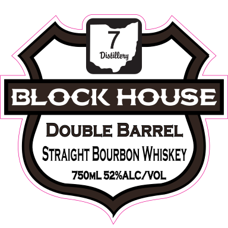
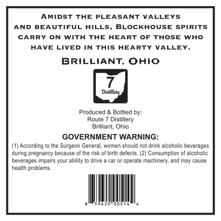

# TTB COLA Label Images - TTBID 26111001000535

**Brand Name:** BLOCK HOUSE

**Fanciful Name:** DOUBLE BARREL

**Issue Date:** 04/23/2026

**Origin Code:** 09

**Product Class/Type:** 101

**Source:** [TTB Public COLA Registry](https://ttbonline.gov/colasonline/viewColaDetails.do?action=publicFormDisplay&ttbid=26111001000535)

## Label Images

### Label 1

### Label 2

## Extracted Label Text

*Text extracted via OCR - may contain errors*

**Detected Proof:** 104

### Label 1

ASS
Distiblery
BLOCK HOUSE
DOUBLE BARREL
STRAIGHT BOURBON WHISKEY
7S50ML 52%ALC/VOL,

### Label 2

AMIDST THE PLEASANT VALLEYS
AND BEAUTIFUL HILLS, BLOCKHOUSE SPIRITS
CARRY ON WITH THE HEART OF THOSE WHO
HAVE LIVED IN THIS HEARTY VALLEY.

BRILLIANT, OHIO

7

Dison

Produced & Bottled by:
Route 7 Distillery
Brillant, Ohio
GOVERNMENT WARNING:
(1) According to the Surgeon General, women should not drink alcoholic beverages
uring pregnancy because ofthe risk of birth defects. (2) Consumption of alcoholic,
beverages impairs your ability to drive a car or operate machinery, and may cause

health problems.
