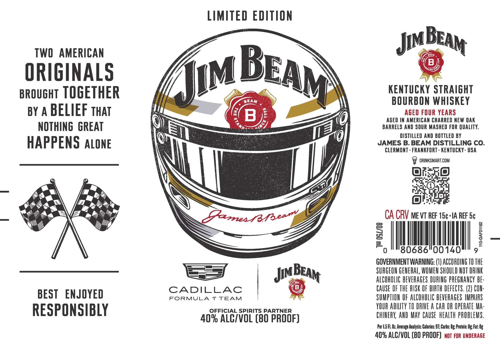

# TTB COLA Label Images - TTBID 26111001000545

**Brand Name:** JIM BEAM

**Issue Date:** 04/23/2026

**Origin Code:** 22

**Product Class/Type:** 101

**Source:** [TTB Public COLA Registry](https://ttbonline.gov/colasonline/viewColaDetails.do?action=publicFormDisplay&ttbid=26111001000545)

## Label Images

### Label 1

### Label 2

## Extracted Label Text

*Text extracted via OCR - may contain errors*

**Detected Proof:** 80

### Label 1

LIMITED EDITION
TWO
AMERICAN
Jim
B
ORIGINALS
BROUGHT TOGETHER
KenTuCKY STRAIGHT
BEAM
BOURBON WHISKEY
BY A
BELIEF THAT
B
AGED FOUR YEARS
&
AGED IN AMERICAN CHARRED NEW OAK
NOTHING  GREAT
ND
BARRELS AND SOUR MASHED FOR QUALITY:
DISTILLED AND BOTTLED BY
HAPPENS ALONE
JAMES B. BEAM DISTILLING CO.
CLERMONT . FRANKFORT - KENTUCKY- USA
DRINKSMART.COM
5aones 7fsear
CA CRV me vT REF 15c-IA REF 5c
2
1
F
0
80686"00140
GOVERNMENT WARNING: (I) ACCORDING TO THE
JIM
SURGEON GENERAL, WOMEN SHOULD NOT DRINK
ALCOhOLIC BEVERAGES DURING PREGNANCY bE:
CADILLAC
CAuse OF THE RUSK OF BIRTH DEFECTS. (2) CON:
BEST
ENJOYED
FORMULA
1 TEAM
SUMPTION OF AlCOhOLIC bEVERAGeS HMPAIPS
RESPONSIBLY
OFFICIAL SPIRITS PARTNER
YOUR abilTY TO DRIVE A CAR OR OpehATe Ma:
409 Alc/VOL (80 pROOF)
ChINERK AND MAY  CAUSE   heALTH pRObLEMS .
Per |.5FL Oz Average Analysis: Calories: 97; Carbs: Ug; Protein: Og Fat: Og
409 ALCIVOL (BQ PROOF)   not For UNDERAGE
BEAM
BEAM
Jim_
1
BEAM

### Label 2

The
JAMESBBEAM
JAMESBBEAM
DISTILLING CO:
DISTILLING CO:
Goustyieso _
Garnea Raear
O6l8
)
