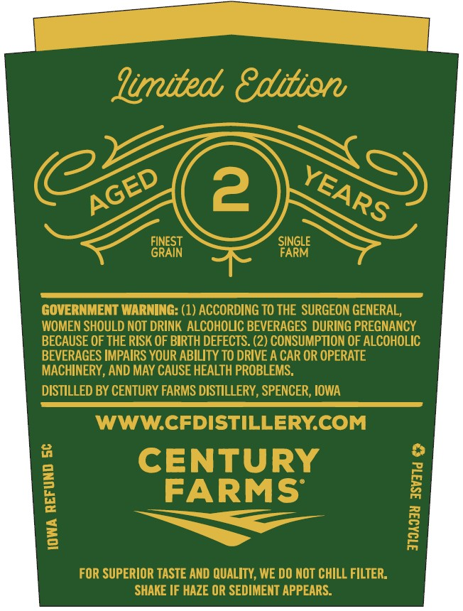
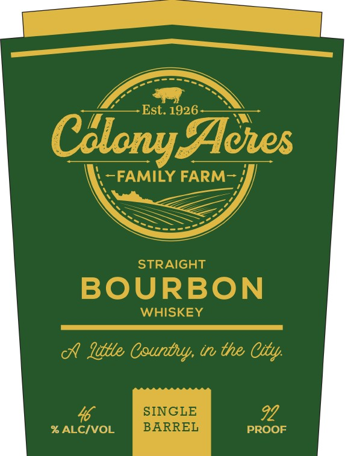

# TTB COLA Label Images - TTBID 26111001000614

**Brand Name:** COLONY ACRES

**Issue Date:** 04/23/2026

**Origin Code:** 20

**Product Class/Type:** 101

**Source:** [TTB Public COLA Registry](https://ttbonline.gov/colasonline/viewColaDetails.do?action=publicFormDisplay&ttbid=26111001000614)

## Label Images

### Back Label

### Front Label

## Extracted Label Text

*Text extracted via OCR - may contain errors*

**Detected Proof:** 92

### Back Label

Jimited 8dition
2
FINEST
SINGLE
GRAIN
FARM
GOVERNMENT WARNING: (1) ACCORDING TO THE  SURGEON GENERAL,
WOMEN SHOULD NOT DRINK ALCOHOLIC BEVERAGES DURING PREGNANCY
BECAUSE OF THE RISK OF BIRTH DEFECTS. (2) CONSUMPTION OF ALCOHOLIC
BEVERAGES IMPAIRS YOUR ABILITY TO DRIVE A CAR OR OPERATE
MACHINERY, AND MAY CAUSE HEALTH PROBLEMS.
DISTILLED BY CENTURY FARMS DISTILLERY , SPENCER, IOWA
WWWCFDISTILLERYCOM
8
CENTURY
FARMS
1
1
1
FOR SUPERIOR TASTE AND QUALITY, WE DO NOT CHILL FILTER:
SHAKE IF HAZE OR SEDIMENT APPEARS:
@
AGED
YEARS
1

### Front Label

Est. 1926
Cslony Aores
FAMILY FARM
STRAIGHT
BOURBON
WHISKEY
Idtle Countuy; tr the City;
46
SINGLE
92
% ALCIVOL
BARREL
PROOF
