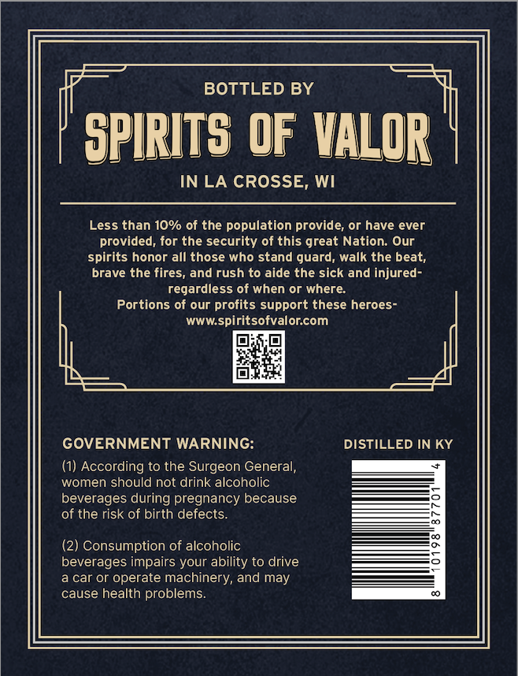
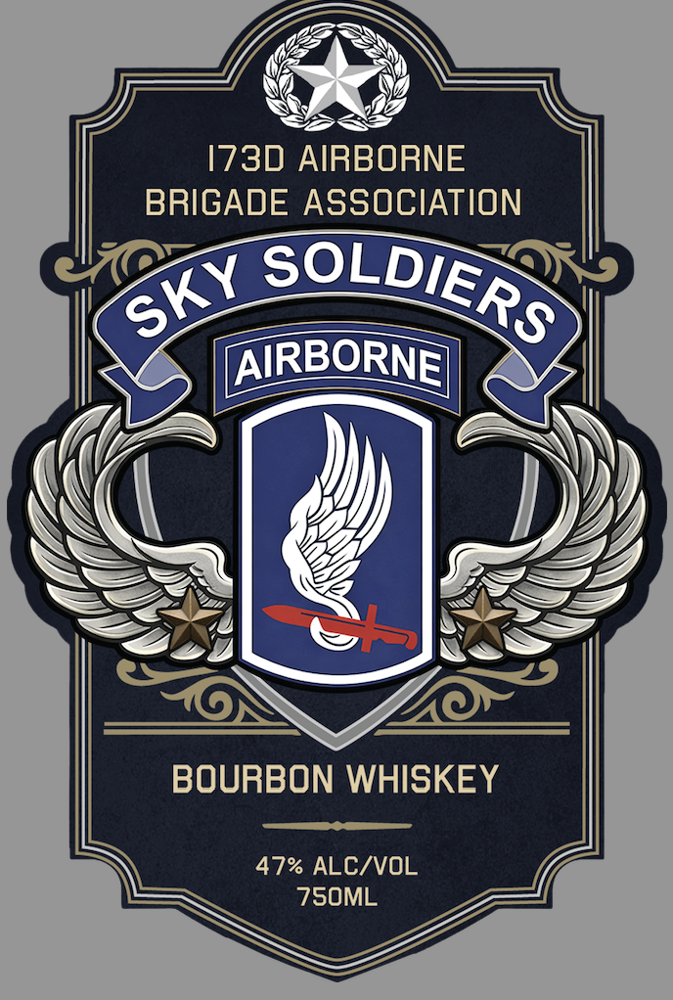

# TTB COLA Label Images - TTBID 26111001000632

**Brand Name:** 173D AIRBORNE

**Issue Date:** 04/27/2026

**Origin Code:** 48

**Product Class/Type:** 141

**Source:** [TTB Public COLA Registry](https://ttbonline.gov/colasonline/viewColaDetails.do?action=publicFormDisplay&ttbid=26111001000632)

## Label Images

### Back Label

### Front Label

## Extracted Label Text

*Text extracted via OCR - may contain errors*

**Detected Proof:** 94

### Back Label

BOTTLED BY
SPIRITS OF VALOR
IN LA CROSSE, WI
Less than 10% of the population provide; or have ever
provided; for the security of this great Nation. Our
spirits honor all those who stand guard; walk the beat;
brave the fires
and rush to aide the sick and injured-
regardless of when or where:
Portions of our profits support these heroes-
WWW spiritsofvalorcom
GOVERNMENT WARNING:
DISTILLED IN KY
(1) According to the Surgeon General,
women should not drink alcoholic
beverages during pregnancy because
of the risk of birth defects:
(2) Consumption of alcoholic
beverages impairs your ability to drive
car or operate machinery, and may
cause health problems:

### Front Label

1730 AIRBORNE
BRIGADE ASSOCIATION
AIRBORNE)
BOURBON WHISKEY
47% ALC/VOL
75OML
SOLDIERS
SKY
