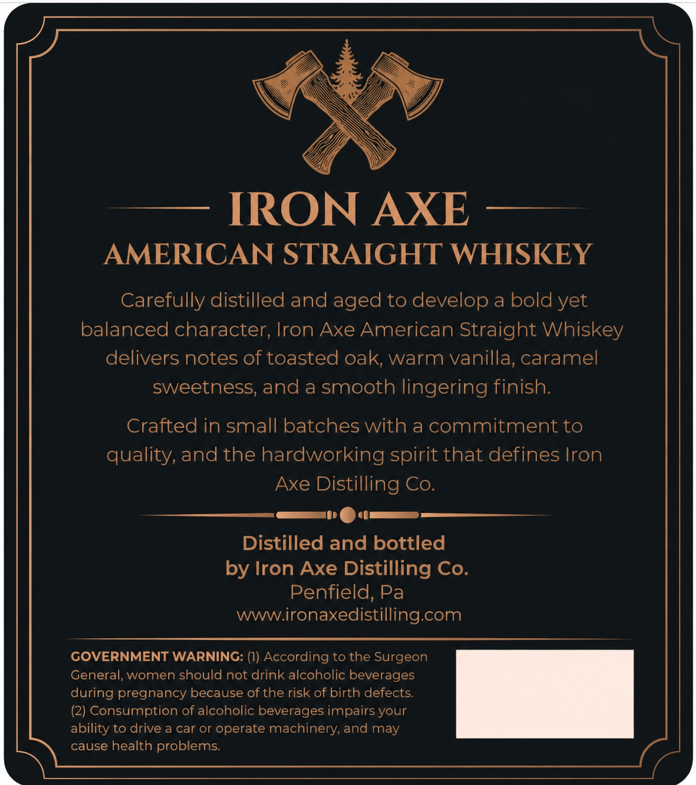
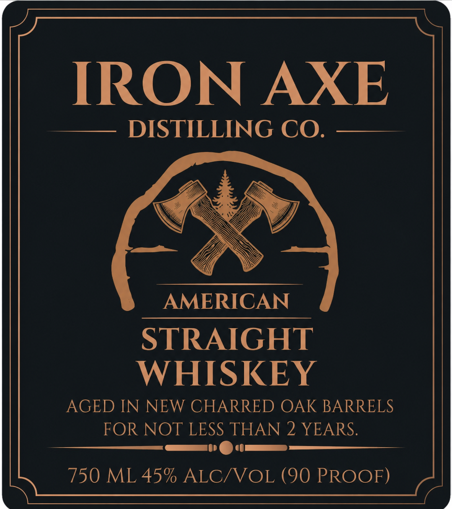

# TTB COLA Label Images - TTBID 26111001000634

**Brand Name:** IRON AXE DISTILLING CO.

**Issue Date:** 04/28/2026

**Origin Code:** 39

**Product Class/Type:** 140

**Source:** [TTB Public COLA Registry](https://ttbonline.gov/colasonline/viewColaDetails.do?action=publicFormDisplay&ttbid=26111001000634)

## Label Images

### Back Label

### Front Label

## Extracted Label Text

*Text extracted via OCR - may contain errors*

**Detected Proof:** 90
**Detected Age:** 2 Years

### Back Label

IRON AXE
AMERICAN STRAIGHT WHISKEY
Carefully distilled and aged to develop a bold yet
balanced character; Iron Axe American Straight Whiskey
delivers notes of toasted oak; warm vanilla, caramel
sweetness; and a smooth lingering finish:
Crafted in small batches with a commitment to
quality, and the hardworking spirit that defines Iron
Axe Distilling Co:
Distilled and bottled
by Iron Axe Distilling Co.
Penfield, Pa
wwwironaxedistilling com
GOVERNMENT WARNING: (I) According to the Surgeon
General, women should not drink alcoholic beverages
during pregnancy because of the risk of birth defects
(2) Consumption of alcoholic beverages impairs your
ability to drive a car or operate machinery; and may
cause health problems:

### Front Label

IRON AXE
DISTILLING CO.
AMERICAN
STRAIGHT
WHISKEY
AGED IN NEW CHARRED OAK BARRELS
FOR NOT LESS THAN 2 YEARS
750 ML 45% ALC/VOL (90 PROOF)
