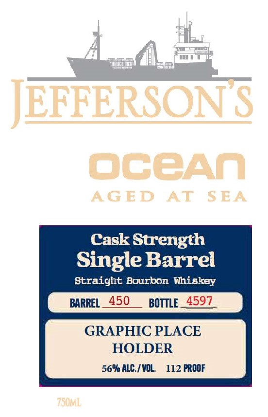
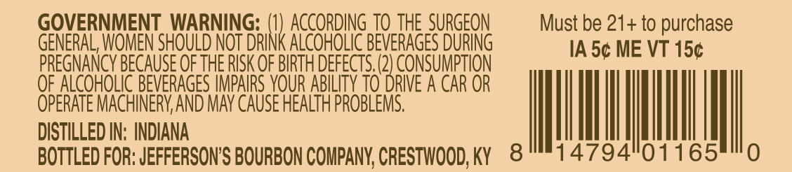

# TTB COLA Label Images - TTBID 26111001000648

**Brand Name:** JEFFERSON'S

**Issue Date:** 04/23/2026

**Origin Code:** 22

**Product Class/Type:** 101

**Source:** [TTB Public COLA Registry](https://ttbonline.gov/colasonline/viewColaDetails.do?action=publicFormDisplay&ttbid=26111001000648)

## Label Images

### Back Label

### Front Label

### Label 3

### Label 4

## Extracted Label Text

*Text extracted via OCR - may contain errors*

*2 image(s) excluded: text did not meet readability threshold*

### Front Label

JEFFERSONS
OCOAA
AGED
AT
S EA
Cask Strength
Single Barrel
Straight Bourbon Whiakey
BARREL
450
BOTTLE_ 4597
GRAPHIC PLACE
HOLDER
56% ALG / VOL
112 FROOF
750ml

### Label 4

GOVERNMENT WARNING:
ACCORDING TO the SURGEON
Must be 21+ to purchase
GENERAL; WOMEN SHOULD NOT DrinK ALCOHOLIC BEVERAGES DURING
IA 5c ME VT 15c
PREGNANCY BECAuSE OFTHE RISK QF BIRTH DefeCTS (2) CONSUMPTION
QF ALCOHOLIC BEVERAGES IMPAIRS VOUR ABILITY TO DRIVE A CAR OR
OPERATE MACHINERV AND MAV CAUSE HEALTH PROBLEMS.
DISTILLED IN: INDIANA
BOTTLED FOR: JEFFERSON'S BOURBON COMPANY; CRESTWOOD; KY
8
14794"01165
0
