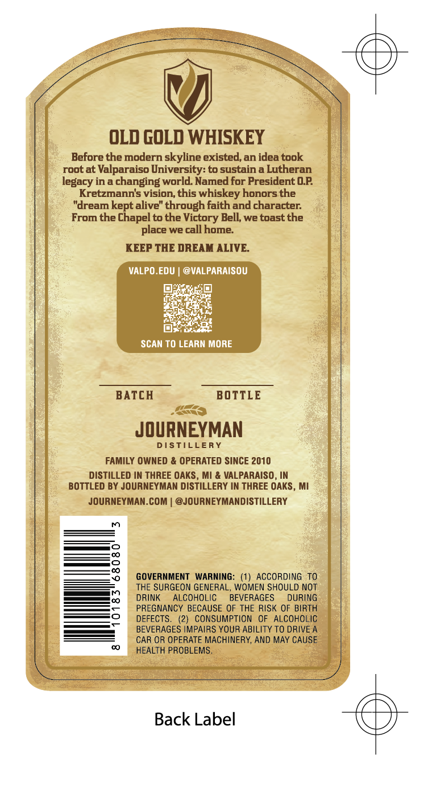
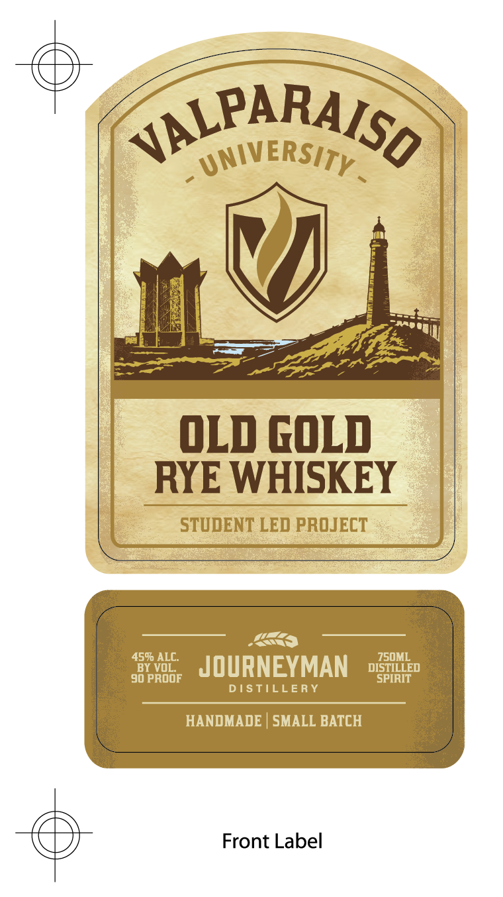

# TTB COLA Label Images - TTBID 26111001000694

**Brand Name:** JOURNEYMAN DISTILLERY

**Fanciful Name:** VALPARAISO UNIVERSITY OLD GOLD RYE WHISKEY

**Issue Date:** 04/28/2026

**Origin Code:** 06

**Product Class/Type:** 142

**Source:** [TTB Public COLA Registry](https://ttbonline.gov/colasonline/viewColaDetails.do?action=publicFormDisplay&ttbid=26111001000694)

## Label Images

### Back Label

### Front Label

## Extracted Label Text

*Text extracted via OCR - may contain errors*

**Detected Proof:** 90

### Back Label

OLD GOLD WHISKEY
Before the modern skyline existed,an idea took
root at Valparaiso University: to sustain a Lutheran
legacy in a changing world Named for President OP
Kretzmanns vision, this whiskey honors the
"dream kept alive" through faith and character:
From the Chapel to the Victory Bell; we toast the
place we call home:
KEEP THE DREAM ALIVE
VALPO.EDU
@VALPARAISOU
SCAN TO LEARN MORE
BATCH
BOTTLE
JOURNEYMAN
DSTILLERY
FAMILY OWNED & OPERATED SINCE 2010
DISTILLED IN THREE OAKS , MI & VALPARAISO , IN
BOTTLED BY JOURNEYMAN DISTILLERY IN THREE OAKS , MI
JOURNEYMAN.COM
@JOURNEYMANDISTILLERY
GOVERNMENT   WARNING:
(1) ACCORDING
To
THE SURGEON GENERAL, WOMEN SHOULD NOT
DRINK
AlCOHOLIC
BEVERAGES
dURING
PREGNANCY BECAUSE OF THE RISK OF BIRTH
DEFECTS_
CoNSUMPTION   OF
ALCOHOLIC
BEVERAGES IMPAIRS YOUR ABILITY TO DRIVE A
CAR OR OPERATE MACHINFRY_
AND MAY CAUSE
HEALTH PROBLEMS_
Back Label

### Front Label

JALPARAISO
UNIVERSITY
OLD GOLd
RYE WHISKEY
STUDENT LED PROJECT
459 ALC;
750ML
BY VOL
JOURNEYMAN
DISTILLED
90 proOF
SPIRIT
DISTILLERY
HANDMADE
SMALL BATCH
Front Label
