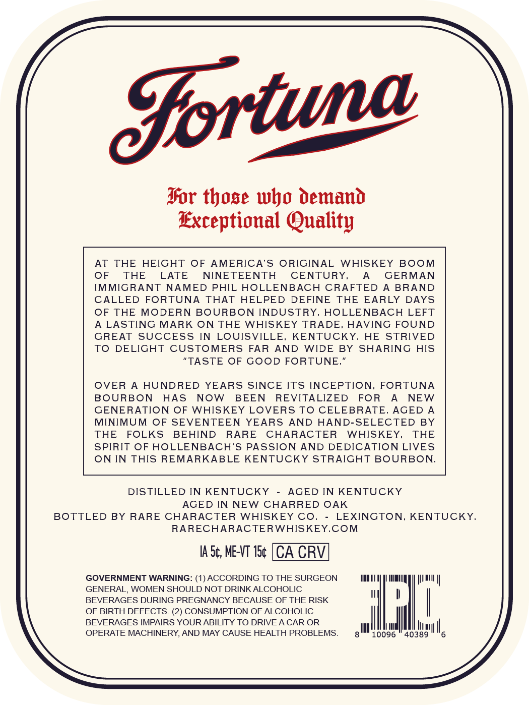
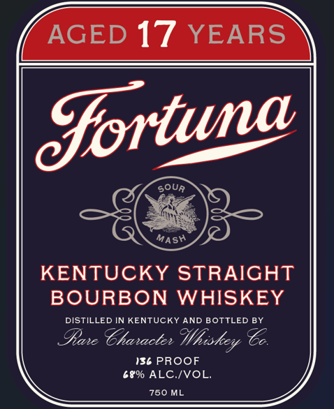

# TTB COLA Label Images - TTBID 26111001000794

**Brand Name:** FORTUNA

**Issue Date:** 05/19/2026

**Origin Code:** 22

**Product Class/Type:** 101

**Source:** [TTB Public COLA Registry](https://ttbonline.gov/colasonline/viewColaDetails.do?action=publicFormDisplay&ttbid=26111001000794)

## Label Images

### Back Label

### Front Label

## Extracted Label Text

*Text extracted via OCR - may contain errors*

**Detected Proof:** 136
**Detected Age:** 17 Years

### Back Label

Jortwa
Tor tbose wbo Demano
Exceptional Quality
AT
THE
HEIGHT
OF
AMERICA'S ORIGINAL
WHISKEY
BOOM
OF
THE
LATE
NINETEENTH
CENTURY,
GERMAN
IMMIGRANT NAMED PHIL HOLLENBACH CRAFTED
A BRAND
CALLED
FORTUNA
THAT
HELPED
DEFINE
THE
EARLY
DAYS
OF THE
MODERN BOURBON INDUSTRY.
HOLLENBACH LEFT
A LASTING MARK ON THE WHISKEY TRADE
HAVING FOUND
GREAT
SUCCESS IN
LOUISVILLE,
KENTUCKY,
HE
STRIVED
To
DELIGHT
CUSTOMERS
FAR
AND
WIDE
BY
SHARING
HIS
"TASTE OF GOOD FORTUNE
OVER
HUNDRED
YEARS SINCE ITS INCEPTION_
FORTUNA
BOURBON
HAS
NOW
BEEN
REVITALIZED
FOR
NEW
GENERATION OF
WHISKEY LOVERS TO CELEBRATE_
AGED
MINIMUM
OF SEVENTEEN
YEARS
AND
HAND-SELECTED
BY
THE
FOLKS
BEHIND
RARE
CHARACTER
WHISKEY,
THE
SPIRIT OF HOLLENBACH'S PASSION AND DEDICATION LIVES
ON IN THIS REMARKABLE KENTUCKY STRAICHT BOURBON
DISTILLED IN KENTUCKY
AGED IN KENTUCKY
AGED IN NEW CHARRED OAK
BOTTLED BY RARE CHARACTER WHISKEY COj
LEXINGTON_
KENTUCKY.
RARECHARAC TERWHISKEY.COM
IA 5c;, ME-VT 15c [CA CRV
GOVERNMENT WARNING: (1) ACCORDING TO THE SURGEON
GENERAL, WOMEN SHOULD NOT DRINK ALCOHOLIC
BEVERAGES DURING PREGNANCY BECAUSE OF THE RISK
OF BIRTH DEFECTS_
2) CONSUMPTION OF ALCOHOLIC
BEVERAGES IMPAIRS YOUR ABILITY TO DRIVEA CAR OR
OPERATE MACHINERY, AND MAY CAUSE HEALTH PROBLEMS
10096
'40389

### Front Label

AGED 17
YEARS
sour
MASH
KENTUCKY STRAIGHT
BOURBON WHISKEY
DISTILLED IN KENTUCKY AND BOTTLED BY
Iane Thanactee
136 PROOF
689 ALC IVOL.
760 ML
Cortuna
Hhiskey
