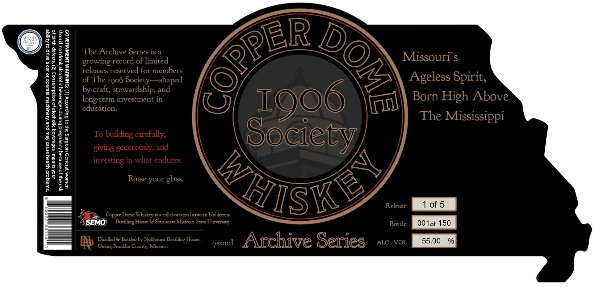

# TTB COLA Label Images - TTBID 26112001000096

**Brand Name:** COPPERDOME

**Issue Date:** 04/23/2026

**Origin Code:** 29

**Product Class/Type:** 140

**Source:** [TTB Public COLA Registry](https://ttbonline.gov/colasonline/viewColaDetails.do?action=publicFormDisplay&ttbid=26112001000096)

## Label Images

### Label 1

### Label 2

## Extracted Label Text

*Text extracted via OCR - may contain errors*

**Detected Proof:** 110

### Label 1

M
7
The Archive Series is a
}
growing record of limited
Missouri s
:
releases reserved for members
1
of The
Society
~shaped
Ageless Spirit,
1
by craft, stewardship; and
long-term investment in
Born High Above
7
8
|
1
3
education.
The Mississippi
2
1
To
carefully,
Society
giving generously; and
H
1
in what endures:
1
'1
1
Raise your glass:
Siske/
Release:
1 of 5
Dome Whiskcy is a collaboration betwren Nobletons
SEMO
Distilling House €) Soutlcist Missotri State University-
Bottle:
OO1of 150
Digrilled € Bottled by Nobletons Diatilling House;
Archive Series
ALC NOL
55.00
%
Union Franklin County; Mieeouri
COPPER
8
I906
I9O6
building =
investing
Copper _
75oml

### Label 2

bs
_——<—<$<<<<<— WHO iS eT h
A ochre Sere Ore SolJOS DATUDIVT
| Archive Series | Aig) SMS 2ARPIY |
SN 0 eee
