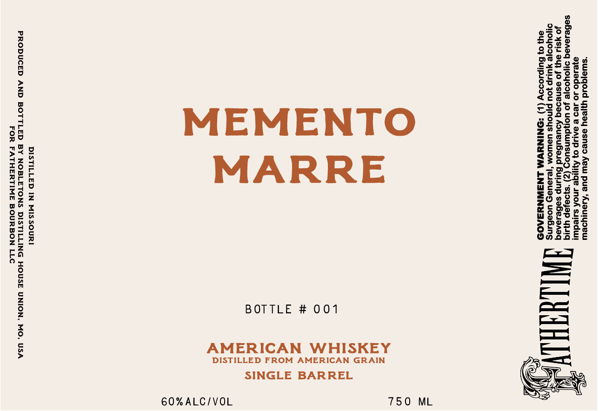

# TTB COLA Label Images - TTBID 26112001000101

**Brand Name:** MEMENTO MARRE

**Issue Date:** 04/23/2026

**Origin Code:** 29

**Product Class/Type:** 140

**Source:** [TTB Public COLA Registry](https://ttbonline.gov/colasonline/viewColaDetails.do?action=publicFormDisplay&ttbid=26112001000101)

## Label Images

### Label 1

## Extracted Label Text

*Text extracted via OCR - may contain errors*

**Detected Proof:** 120

### Label 1

“swajqoid yyyeay esneo Aew pue ‘Auouyoeus
eyesado Jo Je9 & BALIP 0} Ayjige ANoK sued

‘@uy 0} Bulpsoooy (+) -ONINNYVM LNSIWNYZA0D

saBesaneg o1j0yooje Jo uondwinsuog (Z) ‘s}oqjep yAJIG i
40 4S 84) Jo asnedeg AoueuBesd Burunp seBeseneq pAL
d1oYoo|e yULIp jou pjnoys UaWOM ‘je1aUaD UoebuNS

BOTTLE # 001
DISTILLED FROM AMERICAN GRAIN

AMERICAN WHISKEY

MEMENTO
MARRE

DISTILLED IN MISSOURI

PRODUCED AND BOTTLED BY NOBLETONS DISTILLING HOUSE UNION, MO, USA
FOR FATHERTIME BOURBON LLC

SINGLE BARREL

750 ML

60%ALC/VOL
