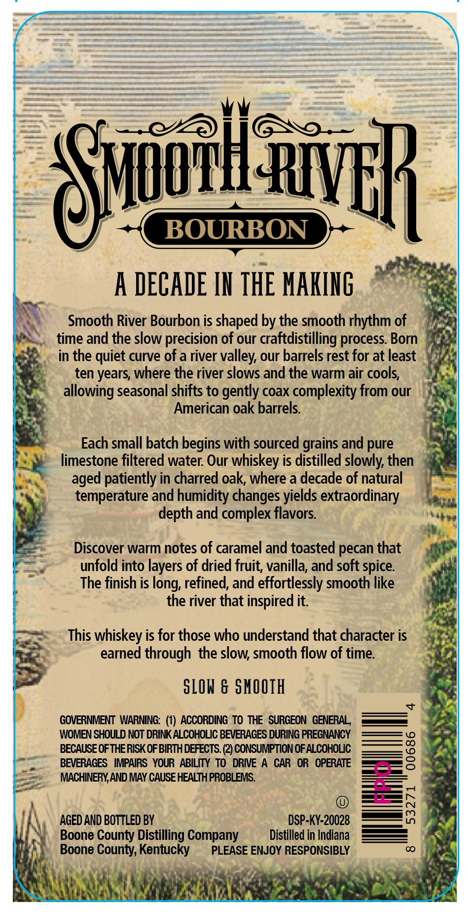
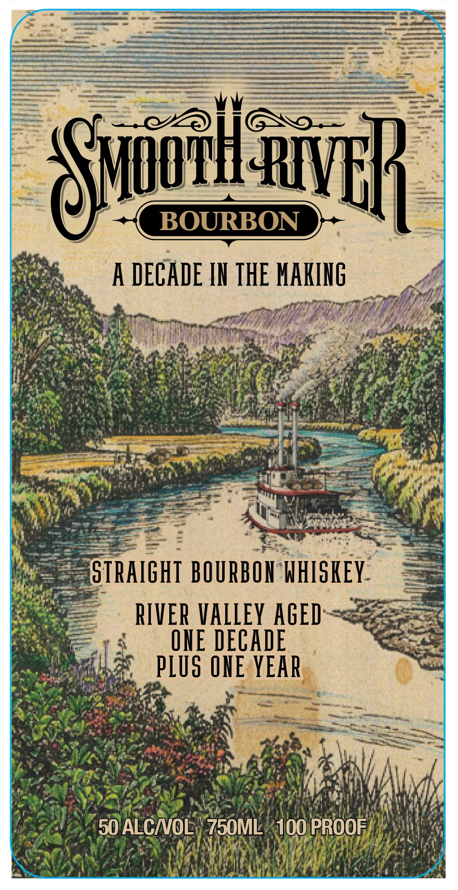
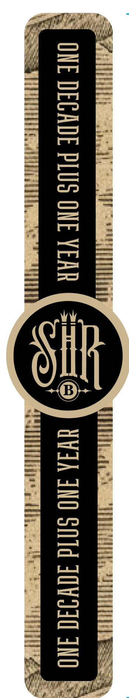

# TTB COLA Label Images - TTBID 26112001000135

**Brand Name:** SMOOTH RIVER

**Issue Date:** 04/23/2026

**Origin Code:** 22

**Product Class/Type:** 101

**Source:** [TTB Public COLA Registry](https://ttbonline.gov/colasonline/viewColaDetails.do?action=publicFormDisplay&ttbid=26112001000135)

## Label Images

### Back Label

### Front Label

### Label 3

## Extracted Label Text

*Text extracted via OCR - may contain errors*

*1 image(s) excluded: text did not meet readability threshold*

### Back Label

BOURBON
HVE
A DECADE IH THE HAKIL6
Smooth River Bourbon is shaped by the smooth rhythm of
time and the slow precision of our craftdistilling process Born
in the quiet curve of a river valley; our barrels rest for at least
ten years, where the river slows and the warm air cools;
allowing seasonal shifts to gently coax complexity from our
American oak barrels
Each small batch begins with sourced grains and pure
limestone filtered water: Our whiskey is distilled slowly; then
aged patiently in charred oak; where a decade of natural
temperature and humidity changes
extraordinary
depth and complex flavors
Discover warm notes of caramel and toasted pecan that
unfold into layers of dried fruit; vanilla; and soft spice
The finish is
refined, and effortlessly smooth like
the river that inspired it
This whiskey is for those who understand that character is
earned through the slow; smooth
of time
SLOW & SHOOIH
GOVERNMENT WARNING: (1) ACCORDING To THE SURGEON GENERAL
WOMEN SHOULD NOT DRINK ALCOHOLIC BEVERAGES DURING PREGNANCY
BECAUSE OFTHERISK OF BIRTH DEFECTS: (2) CONSUMPTION OF ALCOHOVC
3
BEVERAGES   IMPAIRS YOUR ABILITY TO   DRIVE A
CAR  OR   OPERATE
MACHINERY,AND MAY CAUSE HEALTH PROBLEMS.
5
AGED AND BOTTLED BY
DSP-KY-20028
1
Boone County Distilling Company
Distilled in Indiana
Boone County; Kentucky
PLEASE ENJOY RESPONSIBLY
00
SCiuozhl
yields
long;
flow

### Front Label

sail } en —_ = -
—XYNATE DH
— A\MUU aly 9
Sane @) ] ag — qq os
J BOURBON aqme Ga

eh — f
aes A DECADE IN THE MAKING 4
Lae: A yh ; “aa? m ‘
Iga hens SU tee ae eee ey
UE Ie ARG NG icky RIE
Coie aN og oon te allies De eases $1
Bram Mn 2h eae ammo EATS
bE ek Neen i ud eRe
= Sa se 7 NON are ad

Pee rath apie ES eee 1 gan
hay y “a - =3 x ee :

Rorins 77 NA) ee ee ae "uk
eee Ae a
ieee ‘ae
———— ce oe |
(STRAIGHT BOURBON'WHISKEY. =e:
a — —_ RIVER VALLEY AGED-~<Bee=ee
Ss —_ ONE DECADE ae
mem, PLUS ONE YEAR, -

Piast AeM: r
i ene Suc : gear =
3 ee YS ae Pa Ree ‘a a oii D ae < ed
TREN meni platens A |, :
OS SRN NE poh EATERY, mach ) ,
iy SAE YS Deanls rte va wy Mi vi Hy |
PAS!) NAR yp LAAN a) OA OARS aL) a
adok SO ALCNOE; MEISE g pie
SIU A GL aaa
